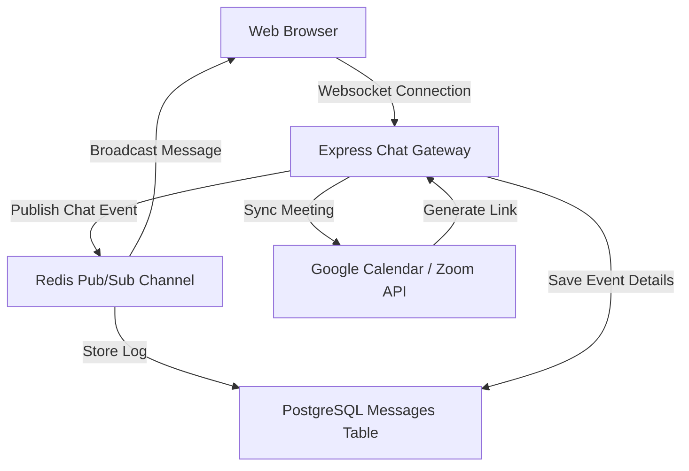

# JIRA Epic & Stories: Collaboration & Communication

This document defines the product and technical details for the Collaboration & Communication module of the Phase 2 Research ERP.

---

## 1. Client Section (Detailed Feature Walkthrough & Real-Time Examples)

### COL-001: Real-Time Project Chat Rooms & Websocket Sync
*   **Business Explanation:** Research teams need immediate messaging channels inside their active project boards. The chat client must run on WebSockets to broadcast messages instantly to all active project members without manual refresh.
*   **How it Works in Real Time:**
    1.  The researcher enters a message on the chat sidebar.
    2.  The frontend sends a payload to the WebSocket server.
    3.  The server writes the message to the database, publishes the event to Redis, and broadcasts it to the project's socket channel (`project_channel_${projectId}`).
    4.  All browsers connected to the channel render the new message instantly.
*   **Real-Time Example:** Dr. Sen types: *"Synthesized batch #09 is ready for inspection"* in the chat panel of the Graphene project page. Kabir, who has the page open in his browser, sees the message bubble pop up instantly.

### COL-002: Threaded Q&A Discussion Boards
*   **How it Works in Real Time:** Forums where teams open specific discussion threads for long-term questions, ideas, or problems.
*   **Real-Time Example:** Kabir starts a thread: *"Salt-spray test anomaly on graphene nozzle."* Dr. Rahul (Tata Steel) replies to the thread, sharing tips on adjusting spray pressures.

### COL-003: Collaborative Live Documents
*   **How it Works in Real Time:** A shared workspace document editor (like a built-in Google Doc) where multiple team members can edit notes at the same time.
*   **Real-Time Example:** Dr. Sen and Kabir open the *"Lab Standard Operating Procedures"* document. Kabir edits the temperature settings on line 12, and Dr. Sen immediately sees his cursors and keystrokes moving in real time.

### COL-004: Mentor Feedback & Review Space
*   **How it Works in Real Time:** A dedicated workspace where mentors can review students' milestone drafts, highlight text, and add feedback notes.
*   **Real-Time Example:** Kabir uploads his baseline report. Dr. Sen highlights the summary paragraph, types: *"Add baseline control numbers from run #08"*, and submits it. Kabir receives a notification with her highlighted correction.

### COL-005: Integrated Video Meetings & Calendar Syncing
*   **How it Works in Real Time:** Users can schedule team catch-ups. The backend makes API calls to Google Calendar or Zoom to generate calendar events and meeting URLs, posting the link to the chat automatically.
*   **Real-Time Example:** Dr. Sen clicks "Schedule Meeting" for Monday at 10:00 AM. The system calls Google Calendar, generates a Google Meet link (`meet.google.com/abc-defg-hij`), adds it to the team's calendars, and posts: *"Dr. Sen has scheduled a catch-up: Monday 10:00 AM [Google Meet Link]"* in the project chat.

---

## 2. Architecture & Flow Diagram

The diagram below details the real-time messaging connections and calendar video integration pathways:



---

## 3. Technical Implementation Details

### Database Schema (Prisma)
Save as part of your primary schema mapping:

```prisma
model ProjectChatMessage {
  id             String         @id @default(uuid())
  projectId      String         
  senderId       String         
  message        String
  attachmentUrl  String?
  
  createdAt      DateTime       @default(now())
  
  @@index([projectId, createdAt])
}

model DiscussionThread {
  id             String         @id @default(uuid())
  title          String
  content        String
  projectId      String         
  creatorId      String         
  
  posts          DiscussionPost[]
  
  createdAt      DateTime       @default(now())
}

model DiscussionPost {
  id             String           @id @default(uuid())
  threadId       String
  thread         DiscussionThread @relation(fields: [threadId], references: [id], onDelete: Cascade)
  authorId       String
  content        String
  
  createdAt      DateTime         @default(now())
}

model ScheduledMeeting {
  id             String         @id @default(uuid())
  title          String
  startTime      DateTime
  endTime        DateTime
  meetingLink    String         
  projectId      String         
  organizerId    String         
  
  createdAt      DateTime       @default(now())
}
```

### WebSocket Controller Connection Example (Socket.io)
Save as a server framework file or bootstrap script:

```javascript
const redis = require("../services/redis.service");

module.exports = (io) => {
  io.on("connection", (socket) => {
    console.log(`🔌 WebSockets: Client connected - ${socket.id}`);

    // Join isolated project channel room
    socket.on("join_project_room", (projectId) => {
      socket.join(`project_room_${projectId}`);
      console.log(`📡 WebSocket: User joined room project_room_${projectId}`);
    });

    // Handle incoming chat message events
    socket.on("send_project_message", async (data) => {
      const { projectId, senderId, message, attachmentUrl } = data;

      // Broadcast payload to all browsers in project room
      io.to(`project_room_${projectId}`).emit("receive_project_message", {
        projectId,
        senderId,
        message,
        attachmentUrl,
        createdAt: new Date().toISOString()
      });
      
      // Secondary publish to Redis channel if scaling multi-node cluster
      await redis.publish("dreamxec:chat", JSON.stringify(data));
    });

    socket.on("disconnect", () => {
      console.log("❌ WebSockets: Client disconnected");
    });
  });
};
```

### JSON Payloads
*   **POST** `/api/collaboration/meetings` (Request):
    ```json
    {
      "projectId": "proj_alloy_7721a",
      "title": "Weekly Alloy Status Review",
      "startTime": "2026-06-29T10:00:00.000Z",
      "endTime": "2026-06-29T11:00:00.000Z"
    }
    ```
*   **POST** `/api/collaboration/meetings` (Response):
    ```json
    {
      "success": true,
      "message": "Meeting scheduled. Invites dispatched.",
      "data": {
        "meetingId": "meet_weekly_771bc",
        "meetingLink": "https://meet.google.com/abc-defg-hij"
      }
    }
    ```
