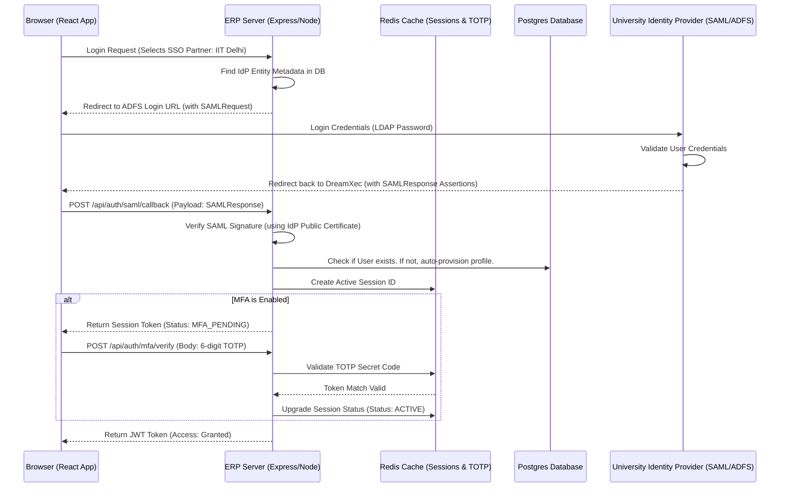

# JIRA Epic & Stories: Identity & Access Management (IAM)

This document provides the production-ready product and technical specifications for the Identity & Access Management module of the DreamXec Research ERP.

---

## 1. Client Section (Detailed Feature Walkthrough & Real-Time Examples)

### IAM-001: Unified User Registration & Institution Domain Mapping
*   **Business Explanation:** The gateway needs to distinguish between students, faculty, sponsors, and external researchers. To prevent manual vetting bottlenecking under scale, the system analyzes email domains. 
*   **How it Works in Real Time:**
    1.  The user types their registration email on the frontend.
    2.  As they type, the frontend sends a background request to verify if the domain (e.g. `anita.sen@iitd.ac.in` -> `iitd.ac.in`) exists in the verified database of organizations.
    3.  If verified, the signup form unlocks the specific organizational roles (e.g., Professor, Researcher, Student) and automatically pre-fills the institution details.
    4.  If the domain is not in the system (e.g., `gmail.com`), the user is prompted to enter an institution invite code or check out as a Guest Donor.
*   **Real-Time Example:** Amit enters `amit@iitd.ac.in` on the register page. Within 150ms, a green checkmark appears: *"IIT Delhi member detected. Your account will automatically sync with the Physics Department upon verification."* A verification link is emailed, containing a 10-minute expiry token.

### IAM-002: Secure Single Sign-On (SSO) & SAML 2.0 Identity Federation
*   **Business Explanation:** University faculty and corporate partners do not want to manage separate passwords. They expect to log in using their employer's active credentials.
*   **How it Works in Real Time:**
    1.  On the login page, the user clicks "Log in via Institution."
    2.  They enter their university domain. The system matches the domain to a SAML 2.0 Identity Provider (IdP) configuration (such as Shibboleth or Active Directory Federation Services).
    3.  The browser redirects to the university login portal.
    4.  Upon successful authentication, the university IdP returns a signed SAML Assertion token.
    5.  DreamXec validates this assertion, matches it to the user record, generates a secure JWT token, and logs the user in.
*   **Real-Time Example:** Dr. Anita Sen selects "IIT Delhi" and is redirected to the campus Web-Login screen. She enters her campus LDAP username/password. The campus server confirms her identity and redirects her back to DreamXec. She is logged in instantly with the role `PROFESSOR`.

### IAM-003: Multi-Factor Authentication (MFA) & Cryptographic Recovery
*   **How it Works in Real Time:** Users can activate Time-based One-Time Passwords (TOTP). During setup, the backend generates an encryptable secret key and converts it into a QR code. The user scans it with Google Authenticator or Duo. To prevent lockouts if a phone is lost, the system generates ten immutable 8-character recovery backup scratch codes.
*   **Real-Time Example:** Dr. Sen completes password login. A prompt demands her 2FA code. Her phone is dead, so she retrieves a saved PDF of her scratch codes, enters `ABCD-1234`, and gains access. The system flags that specific scratch code as `USED` so it can never be used again.

### IAM-004: Permission-Based Access Control (PBAC) & Role Gating
*   **Business Explanation:** Hardcoding roles directly leads to security vulnerabilities. Instead, we map granular permissions to roles in the database.
*   **How it Works in Real Time:**
    *   A student researcher has the role `STUDENT`. This role is linked to permissions: `project:view`, `milestone:submit`.
    *   A Principal Investigator (PI) has the role `PROFESSOR`. This role is linked to permissions: `project:view`, `milestone:approve`, `budget:update`.
    *   When an API request is made, the authorization middleware retrieves the user's active permissions array and matches it against the required key for that endpoint.
*   **Real-Time Example:** Student Amit attempts to edit a project's budget. He clicks "Save Changes". The browser sends a `PATCH` request to `/api/projects/:id/budget`. The server middleware intercepts the request, checks Amit's permissions, finds no `budget:update` permission, and returns a `403 Forbidden` response. Amit’s screen displays: *"Access denied: You do not have budget update authority."*

### IAM-005: Multi-Device Session Management & Live Revocation
*   **How it Works in Real Time:** The server tracks all active sessions in a Redis database. Each session record contains the device footprint (browser, OS, IP address, geographical location) and the login timestamp. Users can view their active sessions from a security dashboard and revoke any session remotely.
*   **Real-Time Example:** Dr. Sen realizes she left her account active on a public library computer. From her personal smartphone, she opens the DreamXec security settings, sees the entry: *"Chrome on Windows - Delhi Public Library (Active Now)"*, and clicks "Revoke Session". The backend deletes that token key from Redis. The library computer is logged out on its next page navigation.

---

## 2. Architecture & Flow Diagram

The diagram below details the federated SSO handshake and multi-factor validation pipeline:



---

## 3. Technical Implementation Details

### Database Schema (Prisma)
Create the schemas in [schema.prisma](file:///c:/ongoing_works/codes/Dreamxec/server/prisma/schema.prisma):

```prisma
enum SystemRole {
  ADMIN
  RESEARCHER
  PROFESSOR
  MENTOR
  CORPORATE_ADMIN
  COMPLIANCE_OFFICER
  STUDENT
}

enum AccountStatus {
  ACTIVE
  BLOCKED
  SUSPENDED
  UNDER_REVIEW
}

model User {
  id              String         @id @default(uuid())
  email           String         @unique
  passwordHash    String?
  mfaEnabled      Boolean        @default(false)
  mfaSecret       String?
  mfaScratchCodes String[]       // Hashed backup recovery codes
  accountStatus   AccountStatus  @default(ACTIVE)
  
  // Relations
  roles           UserRole[]
  sessions        UserSession[]
  studentProfile  StudentProfile?
  employeeProfile EmployeeProfile?
  
  createdAt       DateTime       @default(now())
  updatedAt       DateTime       @updatedAt
  
  @@index([email])
}

model UserRole {
  id     String     @id @default(uuid())
  userId String
  user   User       @relation(fields: [userId], references: [id], onDelete: Cascade)
  role   SystemRole
  
  @@unique([userId, role])
}

model UserSession {
  id          String   @id @default(uuid())
  userId      String
  user        User     @relation(fields: [userId], references: [id], onDelete: Cascade)
  tokenFamily String   // For token rotation tracking
  deviceAgent String
  ipAddress   String
  location    String?
  isActive    Boolean  @default(true)
  expiresAt   DateTime
  
  createdAt   DateTime @default(now())
  
  @@index([userId])
}

model Permission {
  id          String   @id @default(uuid())
  action      String   @unique // e.g. "project:create", "budget:approve"
  description String?
}
```

### Express Middleware: Authorization & Status Checks
Save as `server/src/middleware/auth.middleware.js` to replace the old middleware file:

```javascript
const jwt = require("jsonwebtoken");
const prisma = require("../config/prisma");
const redis = require("../services/redis.service");
const AppError = require("../utils/AppError");

// Verify active JWT and ensure account is ACTIVE
exports.protect = async (req, res, next) => {
  try {
    let token;
    if (req.headers.authorization && req.headers.authorization.startsWith("Bearer")) {
      token = req.headers.authorization.split(" ")[1];
    }

    if (!token) {
      return next(new AppError("You are not logged in. Please sign in to access.", 401));
    }

    // 1. Verify token signature
    const decoded = jwt.verify(token, process.env.JWT_SECRET);

    // 2. Check blacklist in Redis (For revoked sessions/logouts)
    const isBlacklisted = await redis.get(`blacklist:${token}`);
    if (isBlacklisted) {
      return next(new AppError("This session has been terminated. Please log in again.", 401));
    }

    // 3. Query Database for user
    const currentUser = await prisma.user.findUnique({
      where: { id: decoded.id },
      include: { roles: true }
    });

    if (!currentUser) {
      return next(new AppError("The user belonging to this session no longer exists.", 401));
    }

    // 4. Critical Security Check: Account Status Validation
    if (currentUser.accountStatus !== "ACTIVE") {
      return next(
        new AppError(
          `Access Denied: Your account is currently ${currentUser.accountStatus.toLowerCase()}.`,
          403
        )
      );
    }

    // Attach user to request
    req.user = currentUser;
    next();
  } catch (err) {
    return next(new AppError("Authentication failed: Invalid or expired token.", 401));
  }
};

// Check permissions instead of role-checking
exports.requirePermission = (requiredPermission) => {
  return async (req, res, next) => {
    try {
      const userRoles = req.user.roles.map(r => r.role);
      
      // Load permissions associated with the roles from Cache
      const cacheKey = `permissions:${req.user.id}`;
      let permissions = JSON.parse(await redis.get(cacheKey));

      if (!permissions) {
        // Query permissions from DB
        const dbRoles = await prisma.rolePermission.findMany({
          where: { role: { in: userRoles } },
          include: { permission: true }
        });
        permissions = dbRoles.map(rp => rp.permission.action);
        
        // Cache permissions list in Redis for 10 minutes
        await redis.set(cacheKey, JSON.stringify(permissions), "EX", 600);
      }

      if (!permissions.includes(requiredPermission)) {
        return next(new AppError("Access Denied: Inadequate privileges.", 403));
      }
      next();
    } catch (err) {
      next(err);
    }
  };
};
```

### JSON Payloads
*   **POST** `/api/auth/register` (Request):
    ```json
    {
      "email": "anita.sen@iitd.ac.in",
      "password": "SecurePassword123!",
      "role": "PROFESSOR",
      "institutionName": "IIT Delhi"
    }
    ```
*   **POST** `/api/auth/register` (Response):
    ```json
    {
      "success": true,
      "message": "Account created. A verification email has been sent.",
      "data": {
        "userId": "d3b07384-d113-4956-bc9b-117565d7d911",
        "email": "anita.sen@iitd.ac.in",
        "role": "PROFESSOR",
        "verificationRequired": true
      }
    }
    ```
*   **POST** `/api/auth/login` (Response - MFA Pending):
    ```json
    {
      "success": true,
      "message": "Step 1 verification passed. Please enter MFA code.",
      "data": {
        "status": "MFA_PENDING",
        "mfaSessionId": "sess_8291a18bc92d11"
      }
    }
    ```

---

## 4. Seamless Onboarding & Multi-Layer Identity Verification (How We Verify Professors, Donors, and Manage RBAC)

To operationalize the Research ERP, identity onboarding must be seamless while maintaining absolute security. We establish a **Multi-Layer Identity Trust Pipeline** to ensure that professors, corporate sponsors, and donors are automatically authenticated or securely verified.

```
                  ┌── Option A: SSO Attribute Mapping ───────> Auto-Verified [Active]
                  │
Registration ────┼── Option B: Secure Invite Tokens ────────> Auto-Verified [Active]
                  │
                  └── Option C: Manual Registration ─────────> Review Queue [Under Review]
                                                                  └─ ID Card/Tax Verification ─> Approved
```

### A. Seamless Professor Verification: Auto-Vetting Channels
To ensure that a user claiming the `PROFESSOR` role is actually a faculty member at their registered university, we employ three parallel validation layers:

1.  **SAML/LDAP SSO Attribute Extraction (Primary Automated Channel):**
    During the single sign-on handshake (IAM-002), the university's Identity Provider (IdP) sends a SAML Assertion block containing the user's directory attributes. The backend parses claims such as `eduPersonAffiliation` or `employeeType`:
    *   *Logic:* If the attribute `employeeType` matches `"faculty"` or `"professor"`, the registration controller bypasses the approval queue, sets `studentVerified` and `clubVerified` to `true`, and assigns the role `PROFESSOR`.
    *   *Real-Time Scenario:* Dr. Sen logs in via IIT Delhi SSO. The SAML payload contains:
        ```xml
        <saml:Attribute Name="employeeType">
            <saml:AttributeValue>faculty</saml:AttributeValue>
        </saml:Attribute>
        ```
        The server matches this token and immediately grants her Principal Investigator (PI) credentials.

2.  **Cryptographic Invite Tokens (Secondary Automated Channel):**
    If the university does not support SSO, department heads can generate secure invitation links in bulk:
    *   The admin uploads a list of faculty emails and roles. The server generates a JWT token containing `{ email, role: "PROFESSOR", orgId }` signed with a system invite secret.
    *   The user receives a signup link: `/register?token=INVITE_JWT_TOKEN`.
    *   When the user clicks the link, the system decodes the token, registers the user, and marks their account as verified.
    *   *Zod Validation Schema (Invite Token Validation):*
        ```typescript
        const inviteRegistrationSchema = z.object({
          token: z.string(), // Cryptographically signed JWT invite token
          password: z.string().min(8).regex(/[A-Z]/).regex(/[0-9]/),
          name: z.string().min(2)
        });
        ```

3.  **Manual ID Vetting & Reference Check (Fallback Channel):**
    If a professor registers manually using their email without an invite token, their status is set to `UNDER_REVIEW`.
    *   The registration form requests:
        1. A high-resolution scan of their University Identity Card (stored in a secure S3 bucket).
        2. A URL to their official Faculty Profile Page on the university's website.
    *   The request goes to the organization's verified Administrators. They check that the registrant's email matches the faculty directory and approve the request.

### B. Donor Verification: Legitimacy & AML Compliance
To prevent fraudulent accounts, tax evasion (via fake donation claims), and money laundering, donors are verified through a multi-stage validation engine:

1.  **Automated Tax ID (PAN / EIN) API Verification:**
    For Indian individual donors requesting tax deductions (e.g. 80G receipts), they must enter their Permanent Account Number (PAN). Corporate donors must enter their Business Tax Identification Number (EIN / Corporate PAN).
    *   *The System Check:* The backend makes an API call to the national tax registry (e.g., NSDL PAN Verification service) to verify that the PAN is valid and matches the user's legal name.
    *   *API Controller Verification Snippet:*
        ```javascript
        const verifyTaxId = async (taxId, legalName) => {
          const response = await fetch(`${process.env.TAX_API_URL}/verify`, {
            method: "POST",
            headers: { "Authorization": `Bearer ${process.env.TAX_API_KEY}` },
            body: JSON.stringify({ pan: taxId })
          });
          const result = await response.json();
          // Verify name similarity using Levenshtein distance or exact match
          return result.valid && result.registeredName.toLowerCase() === legalName.toLowerCase();
        };
        ```

2.  **Corporate Domain Verification:**
    Corporate Sponsors must register using their official company domains. When they request to create a corporate donor account:
    *   The system checks if the domain matches a verified corporate entity.
    *   The system sends a verification code to their official email.
    *   If verified, they are assigned the role `CORPORATE_ADMIN`.

3.  **Anti-Money Laundering (AML) Escrow Holds:**
    To ensure financial safety, donations above a specific threshold (e.g. 50,000 INR) are automatically held in a pending state until:
    1.  The payment gateway (Stripe/Razorpay) confirms the card/bank account details are clear.
    2.  The donor's tax information is validated.
    3.  Once cleared, the system releases the funds to the project wallet.

