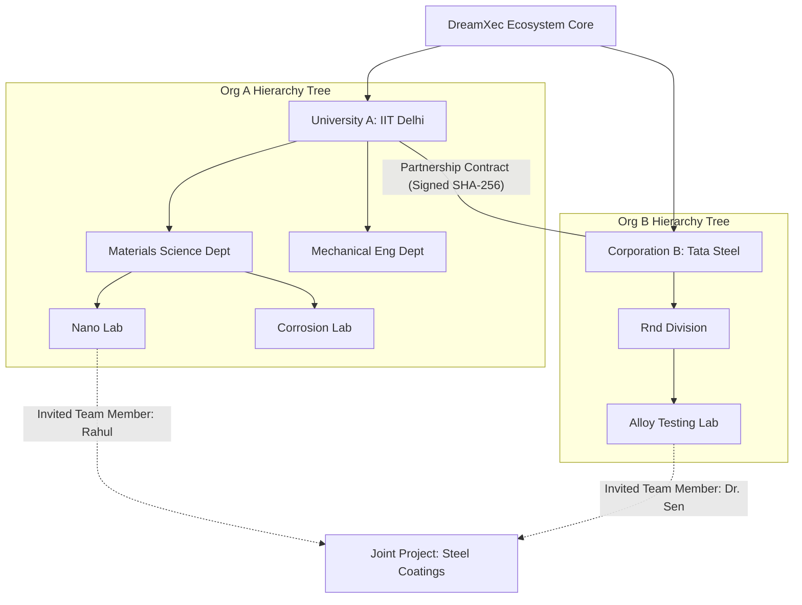

# JIRA Epic & Stories: Organization & Ecosystem Management

This document outlines the detailed specifications, logics, and architectural pathways for the Organization & Ecosystem Management module in the Phase 2 Research ERP.

---

## 1. Client Section (Detailed Feature Walkthrough & Real-Time Examples)

### ORG-001: Self-Service Institutional Onboarding & White-Label Setup
*   **Business Explanation:** Different universities and corporations need to customize the ERP interface to match their branding (logo, colors, and portal subdomains). During onboarding, they declare email domain filters to automate user matching.
*   **How it Works in Real Time:**
    1.  An authorized university administrator visits the portal and registers the organization.
    2.  They define white-label parameters, such as corporate logo file, brand color hex codes, and subdomain name (e.g. `iitd.dreamxec.com`).
    3.  The system updates the DNS lookup table and isolates the workspace styling configurations.
*   **Real-Time Example:** The administrator of IIT Delhi registers the institution, selects brand colors `#D0202F` (Deep Red) and uploads the school logo. When Dr. Sen visits `iitd.dreamxec.com`, she sees the custom red interface, signaling she is in the official IIT Delhi workspace.

### ORG-002: Verification Queue & Cryptographic Compliance Audits
*   **Business Explanation:** To prevent fake colleges or corporations from accessing funding databases, registration requests must pass through an admin-approval panel.
*   **How it Works in Real Time:**
    1.  Upon registration, the organization enters status `PENDING_VERIFICATION`.
    2.  Admins review uploaded government accreditation certificates.
    3.  When approved, the system generates a cryptographic certificate hash and appends it to the organization record, changing status to `ACTIVE`.
*   **Real-Time Example:** Tata Steel R&D submits their corporate tax registration. The system admin verifies the corporate number against the national tax API, clicks "Approve", and the status transitions. Tata Steel can now publish research grants.

### ORG-003: Multi-Level Department & Laboratory Hierarchical Trees
*   **Business Explanation:** Large organizations have complex internal divisions. We model these divisions as a tree of departments and child labs to enforce permission scoping.
*   **How it Works in Real Time:**
    1.  Inside the Admin Dashboard, the organization owner clicks "Add Department."
    2.  They create the parent department (e.g., Materials Science).
    3.  Underneath the department, they add child lab workspace nodes (e.g., Nano Coating Lab).
    4.  Permissions flow down the tree: an administrator of the Physics Department automatically has viewing access to all child lab workspaces, but a scientist in Lab A cannot view files in Lab B without permission keys.
*   **Real-Time Example:** IIT Delhi Admin registers the Chemistry Department, then adds a nested node: "Organic Synthesis Lab." Dr. Sen is assigned as the Lab Lead. When student Amit registers, he is linked to the Chemistry Department, but he cannot access the Organic Synthesis Lab's file directories until Dr. Sen approves his access request.

### ORG-004: Digital Collaboration Memorandums (MoU) & Public-Key Signature Tracking
*   **How it Works in Real Time:** Two organizations must establish a signed agreement before they can share files or schedule resources.
    1.  IIT Delhi initiates a partnership with Tata Steel.
    2.  The portal generates a contract PDF. Both representatives sign the contract electronically.
    3.  The backend verifies the signatures, calculates a SHA-256 hash of the final PDF, and logs the hash in the `Partnership` table.
*   **Real-Time Example:** Tata Steel R&D and IIT Delhi sign a joint research MoU. The system logs the active status. Dr. Rahul (Tata Steel) can now search the IIT Delhi equipment index and book their metallurgy machines directly.

### ORG-005: Ecosystem Dashboard Rollups & Real-Time Analytics
*   **How it Works in Real Time:** The dashboard aggregates stats across joint projects. To prevent performance degradation from live database calculations, the system uses Redis to cache analytical rollup metrics.
*   **Real-Time Example:** The dashboard shows that IIT Delhi is running `14` joint projects with Tata Steel, utilizing `4,500,000 INR` of funding. This is cached in Redis and updated every 12 hours via background database Cron jobs.

---

## 2. Architecture & Flow Diagram

The diagram below details the organizational tree mapping and the cross-organization partnership verification flow:



---

## 3. Technical Implementation Details

### Database Schema (Prisma)
Save as part of your primary schema mapping:

```prisma
model Organization {
  id              String         @id @default(uuid())
  name            String
  slug            String         @unique
  logoUrl         String?
  brandColor      String         @default("#D0202F")
  subdomain       String         @unique
  verified        Boolean        @default(false)
  
  // Relations
  departments     Department[]
  members         OrgMember[]
  partnershipsSent Partnership[] @relation("PartnershipSender")
  partnershipsRecv Partnership[] @relation("PartnershipReceiver")
  
  createdAt       DateTime       @default(now())
  updatedAt       DateTime       @updatedAt
}

model Department {
  id             String         @id @default(uuid())
  name           String
  orgId          String
  organization   Organization   @relation(fields: [orgId], references: [id], onDelete: Cascade)
  researchGroups ResearchGroup[]
  
  createdAt      DateTime       @default(now())
}

model ResearchGroup {
  id             String         @id @default(uuid())
  name           String
  deptId         String
  department     Department     @relation(fields: [deptId], references: [id], onDelete: Cascade)
  leaderId       String?        
  
  createdAt      DateTime       @default(now())
}

model Partnership {
  id             String       @id @default(uuid())
  senderOrgId    String
  senderOrg      Organization @relation("PartnershipSender", fields: [senderOrgId], references: [id])
  receiverOrgId  String
  receiverOrg    Organization @relation("PartnershipReceiver", fields: [receiverOrgId], references: [id])
  status         String       @default("PENDING") // PENDING, ACTIVE, INACTIVE
  agreementHash  String?      // SHA-256 contract hash
  signedDocUrl   String?      
  
  createdAt      DateTime     @default(now())
  updatedAt      DateTime     @updatedAt
  
  @@unique([senderOrgId, receiverOrgId])
}

model OrgMember {
  id             String       @id @default(uuid())
  orgId          String
  organization   Organization @relation(fields: [orgId], references: [id], onDelete: Cascade)
  userId         String
  role           String       @default("MEMBER") // ADMIN, OWNER, MEMBER
  
  createdAt      DateTime     @default(now())
  
  @@unique([orgId, userId])
}
```

### Express Controller: Double-Signature MoU Approval Verification
Save as `server/src/api/admin-club/partnership.controller.js` or matching routes:

```javascript
const prisma = require("../../config/prisma");
const catchAsync = require("../../utils/catchAsync");
const AppError = require("../../utils/AppError");
const crypto = require("crypto");

exports.approvePartnership = catchAsync(async (req, res, next) => {
  const { partnershipId, documentUrl } = req.body;

  // 1. Load pending partnership
  const partnership = await prisma.partnership.findUnique({
    where: { id: partnershipId },
    include: { senderOrg: true, receiverOrg: true }
  });

  if (!partnership) {
    return next(new AppError("Partnership record not found.", 404));
  }

  // Ensure caller is the administrator of the receiving organization
  const isAdmin = await prisma.orgMember.findFirst({
    where: {
      orgId: partnership.receiverOrgId,
      userId: req.user.id,
      role: "ADMIN"
    }
  });

  if (!isAdmin) {
    return next(new AppError("Unauthorized: Only receiving admins can approve partnerships.", 403));
  }

  // 2. Cryptographic signature generation (Mock/System audit trail)
  const docBuffer = Buffer.from(`${partnership.senderOrgId}|${partnership.receiverOrgId}|${Date.now()}`);
  const agreementHash = crypto.createHash("sha256").update(docBuffer).digest("hex");

  // 3. Update status in a transactional write
  const updatedPartnership = await prisma.$transaction(async (tx) => {
    return await tx.partnership.update({
      where: { id: partnershipId },
      data: {
        status: "ACTIVE",
        agreementHash,
        signedDocUrl: documentUrl
      }
    });
  });

  res.status(200).json({
    success: true,
    message: "Partnership activated successfully. Shared directory directories unlocked.",
    data: {
      partnership: updatedPartnership
    }
  });
});
```

### JSON Payloads
*   **POST** `/api/organizations/partnerships` (Request):
    ```json
    {
      "senderOrgId": "org_iitd_88192a",
      "receiverOrgId": "org_tatasteel_77182b"
    }
    ```
*   **POST** `/api/organizations/partnerships` (Response):
    ```json
    {
      "success": true,
      "message": "Partnership proposal created. Pending signature from Tata Steel.",
      "data": {
        "partnershipId": "part_992aa18bc00",
        "status": "PENDING"
      }
    }
    ```
