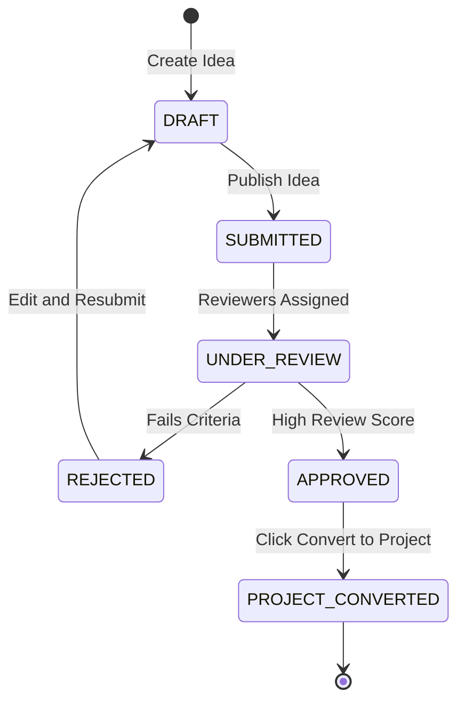

# JIRA Epic & Stories: Idea & Proposal Management

This document defines the product and technical details for the Idea & Proposal Management module of the Phase 2 Research ERP.

---

## 1. Client Section (Detailed Feature Walkthrough & Real-Time Examples)

### IDEA-001: Idea Submission Pipeline & Interactive Editor
*   **Business Explanation:** Before funding or projects can be created, researchers need a collaborative notebook to pitch and save concept drafts.
*   **How it Works in Real Time:**
    1.  A user creates a new idea sheet. The browser renders a rich markdown editor.
    2.  The editor autosaves the text every 10 seconds to a draft collection, preventing loss of work.
    3.  The researcher can keep the idea in `DRAFT` or click `SUBMIT` to push it to their institution's pitch queue.
*   **Real-Time Example:** Student Kabir opens the editor, types in his draft: *"Graphene Desalination Filter V2"*, attaches schematic images, and sees a green notification: *"Draft autosaved 2 seconds ago."* He clicks "Submit to Pitch Pool" once completed.

### IDEA-002: Technology Readiness (TRL) & SDG Tagging Matrix
*   **Business Explanation:** To match ideas with corporate sponsors, ideas must be indexed against Technology Readiness Levels (TRL 1 to TRL 9) and UN Sustainable Development Goals (SDG).
*   **How it Works in Real Time:**
    *   Applicants must select a TRL level representing how developed their research is (e.g. TRL 1: Basic Principles, TRL 9: Proven System).
    *   They tag the proposal with matching SDG goals (e.g. SDG 6: Clean Water, SDG 7: Clean Energy).
    *   Sponsors search these tags to find projects that match their corporate funding budgets.
*   **Real-Time Example:** Kabir tags his desalinator idea as **TRL 3 (Proof of Concept)** and select **SDG 6 (Clean Water)**. A CSR sponsor filtering the dashboard for "Clean Water" ideas instantly finds Kabir's proposal.

### IDEA-003: Double-Blind Review Queue Assignment Logic
*   **Business Explanation:** Reviewers must evaluate ideas without bias. The system must hide identity details between reviewer and creator.
*   **How it Works in Real Time:**
    1.  When an idea is submitted, the system flags the creator ID.
    2.  An editor selects "Assign Reviewers." The system displays a list of potential reviewers, hiding their names and showing only their tags (e.g. *"Reviewer #81A: Expert in Nano Metallurgy"*).
    3.  The system checks for conflicts of interest (e.g., if a reviewer shares the same department as the creator, they are hidden from selection).
    4.  Review assignments are written to the database.
*   **Real-Time Example:** Kabir’s desalination idea is assigned to Dr. Sen. On Dr. Sen's dashboard, she sees the proposal listed under ID `IDEA-9921` with author name hidden. On Kabir's side, he sees his reviewer listed as `Reviewer #812`.

### IDEA-004: Feasibility, Novelty & Impact Weighted Scoring
*   **How it Works in Real Time:** Reviewers submit scores from 1 to 5 on three axes: Novelty, Feasibility, and Impact. The system applies weight multipliers (e.g., Novelty: 30%, Feasibility: 30%, Impact: 40%) to calculate a weighted aggregate score. If the score exceeds `3.8/5.0`, the system automatically moves the idea's status to `APPROVED`.
*   **Real-Time Example:** Dr. Sen scores Kabir's idea: Novelty: `4`, Feasibility: `3`, Impact: `5`. The system calculates: `(4 * 0.3) + (3 * 0.3) + (5 * 0.4) = 4.1`. Because `4.1 >= 3.8`, the system auto-promotes the status to `APPROVED` and sends a notification.

### IDEA-005: Convert-to-Project Transaction Setup
*   **How it Works in Real Time:** Approved ideas are converted to active projects with a single click. The backend executes this as a database transaction, cloning descriptions, tags, and member links, and deletes the draft cache.
*   **Real-Time Example:** Kabir clicks "Convert to Project". The server initializes project `PRJ-992`, creates five baseline stage milestones, sets the status to `DISCOVERY`, and redirects Kabir to his new active project board.

---

## 2. Architecture & Flow Diagram

The diagram below details the state machine transition of an idea through review to project activation:



---

## 3. Technical Implementation Details

### Database Schema (Prisma)
Save as part of your primary schema mapping:

```prisma
enum TRL_Level {
  TRL_1_BASIC_PRINCIPLES
  TRL_2_CONCEPT_FORMULATED
  TRL_3_PROOF_OF_CONCEPT
  TRL_4_LAB_VALIDATION
  TRL_5_ENVIRONMENT_VALIDATED
  TRL_6_PROTOTYPE_DEMONSTRATED
  TRL_7_OPERATIONAL_DEMO
  TRL_8_SYSTEM_COMPLETE
  TRL_9_PROVEN_DEPLOYMENT
}

model Idea {
  id             String         @id @default(uuid())
  title          String
  description    String
  expectedImpact String
  trlLevel       TRL_Level      @default(TRL_1_BASIC_PRINCIPLES)
  technologyArea String[]
  sdgGoals       Int[]          
  status         String         @default("DRAFT") // DRAFT, SUBMITTED, UNDER_REVIEW, APPROVED, REJECTED, CONVERTED
  creatorId      String
  
  // Relations
  reviews        IdeaReview[]
  collaborators  IdeaCollaborator[]
  
  createdAt      DateTime       @default(now())
  updatedAt      DateTime       @updatedAt
  
  @@index([creatorId])
  @@index([status])
}

model IdeaReview {
  id             String         @id @default(uuid())
  ideaId         String
  idea           Idea           @relation(fields: [ideaId], references: [id], onDelete: Cascade)
  reviewerId     String
  scoreNovelty   Int            // 1 to 5
  scoreFeasible  Int            // 1 to 5
  scoreImpact    Int            // 1 to 5
  comment        String?
  
  createdAt      DateTime       @default(now())
  
  @@unique([ideaId, reviewerId])
}

model IdeaCollaborator {
  id             String         @id @default(uuid())
  ideaId         String
  idea           Idea           @relation(fields: [ideaId], references: [id], onDelete: Cascade)
  userId         String
  status         String         @default("PENDING") // PENDING, ACCEPTED, REJECTED
  
  createdAt      DateTime       @default(now())
}
```

### Express Controller: Idea to Project Transaction
Save as `server/src/api/projects/idea.controller.js` or matching routes:

```javascript
const prisma = require("../../config/prisma");
const catchAsync = require("../../utils/catchAsync");
const AppError = require("../../utils/AppError");

exports.convertToProject = catchAsync(async (req, res, next) => {
  const { ideaId } = req.params;

  // 1. Fetch idea and verify details
  const idea = await prisma.idea.findUnique({
    where: { id: ideaId },
    include: { collaborators: true }
  });

  if (!idea) {
    return next(new AppError("Idea not found.", 404));
  }

  if (idea.creatorId !== req.user.id) {
    return next(new AppError("Unauthorized: Only the creator can convert this idea.", 403));
  }

  if (idea.status !== "APPROVED") {
    return next(new AppError("Conflict: Only approved ideas can be converted to projects.", 400));
  }

  // 2. Perform conversion in a strict transaction
  const project = await prisma.$transaction(async (tx) => {
    // A. Create the ResearchProject
    const createdProject = await tx.researchProject.create({
      data: {
        title: idea.title,
        description: idea.description,
        ownerId: idea.creatorId,
        currentStage: "DISCOVERY",
      }
    });

    // B. Link collaborators to ProjectMember list
    const activeCollaborators = idea.collaborators.filter(c => c.status === "ACCEPTED");
    if (activeCollaborators.length > 0) {
      await tx.projectMember.createMany({
        data: activeCollaborators.map(c => ({
          projectId: createdProject.id,
          userId: c.userId,
          role: "RESEARCHER"
        }))
      });
    }

    // C. Add default Project Owner Member role
    await tx.projectMember.create({
      data: {
        projectId: createdProject.id,
        userId: idea.creatorId,
        role: "MANAGER"
      }
    });

    // D. Update Idea status to CONVERTED
    await tx.idea.update({
      where: { id: ideaId },
      data: { status: "CONVERTED" }
    });

    return createdProject;
  });

  res.status(201).json({
    success: true,
    message: "Idea successfully converted to an active Research Project.",
    data: {
      projectId: project.id,
      currentStage: project.currentStage
    }
  });
});
```

### JSON Payloads
*   **POST** `/api/ideas` (Request):
    ```json
    {
      "title": "Graphene Desalination Filters",
      "description": "High-permeability filters utilizing carbon sheets.",
      "expectedImpact": "Reduces costs of seawater desalination by 40%.",
      "trlLevel": "TRL_3_PROOF_OF_CONCEPT",
      "sdgGoals": [6, 9]
    }
    ```
*   **POST** `/api/ideas` (Response):
    ```json
    {
      "success": true,
      "message": "Idea submitted to review pool successfully.",
      "data": {
        "ideaId": "idea_882a1b9201a",
        "status": "SUBMITTED"
      }
    }
    ```
