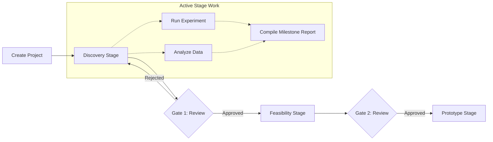

# JIRA Epic & Stories: Research Project & Portfolio Management

This document defines the product and technical details for the Research Project & Portfolio Management module of the Phase 2 Research ERP.

---

## 1. Client Section (Detailed Feature Walkthrough & Real-Time Examples)

### PROJ-001: R&D Stage-Gate Life Cycle Progression
*   **Business Explanation:** Research projects are complex and risky. To prevent wasting budget, projects must progress through five strict phases: Discovery, Feasibility, Prototype, Pilot, and Commercialization. 
*   **How it Works in Real Time:**
    1.  The project is created in the `DISCOVERY` stage.
    2.  Work outside the current stage is restricted; for example, the team cannot post tasks or request materials for the `PROTOTYPE` phase while still in the `DISCOVERY` phase.
    3.  Moving to the next stage requires completing all active stage milestones.
*   **Real-Time Example:** The project *"Graphene Alloys"* starts in the **Discovery Stage**. Kabir tries to create a task: *"Build test-line prototype nozzle."* The system blocks it: *"Laser cutting tasks belong to the Prototype Stage. You must pass Gate 1 and Gate 2 first."*

### PROJ-002: Stage Gate Board Approvals & Voting Logic
*   **Business Explanation:** Advancing stages requires sign-offs from assigned coordinators, PIs, and corporate sponsors.
*   **How it Works in Real Time:**
    *   The project manager clicks "Request Gate Pass."
    *   The system locks the project board (blocking edits) and routes a review request to the board panel.
    *   Reviewers vote `APPROVE` or `REJECT`.
    *   The system tracks the votes. If a majority (or unanimous vote, based on config) approves, the board unlocks, and the project advances.
*   **Real-Time Example:** Dr. Sen finishes Discovery. She requests a **Gate 1 Pass**. The system locks the Graphene project from changes. Dr. Rahul (Tata Steel) reviews the files and clicks "Approve." The database changes the project's active stage to `FEASIBILITY`, and the editing functions unlock.

### PROJ-003: Task Allocation & Budget Scope Caps
*   **How it Works in Real Time:** Managers assign tasks, set due dates, and specify a maximum budget limit for the task. If the sum of task budgets exceeds the overall stage budget, the action is blocked.
*   **Real-Time Example:** Dr. Sen creates a task for Kabir: *"Salt-spray testing"* with a budget allocation of 50,000 INR. If she tries to allocate 500,000 INR (which exceeds the current stage's remaining funding balance of 300,000 INR), the system displays: *"Allocation error: Stage funding limit exceeded."*

### PROJ-004: Milestones & Dynamic Dependency Rescheduling
*   **How it Works in Real Time:** When one project or task depends on another, their timelines are linked. If the parent task gets delayed, the server calculates the difference and automatically shifts all dependent task start dates.
*   **Real-Time Example:** The task *"Corrosion Test"* depends on *"Alloy Sample Synthesis"*. If the synthesis task is delayed by 5 days, the system automatically shifts the corrosion test task calendar range out by 5 days, sending alerts to the assigned researchers.

### PROJ-005: Gantt Timelines & Critical Path Calculation
*   **How it Works in Real Time:** The UI builds an interactive Gantt chart. The backend parses all tasks and dependencies, calculating the "Critical Path" (the sequence of dependent tasks that determines the shortest duration to complete the project). Any delay in critical path tasks turns them red.
*   **Real-Time Example:** Dr. Sen opens the Gantt panel. The system highlights the tasks *"Sample Synthesis"* and *"Gate 1 Approval"* in red, indicating that they lie on the critical path.

---

## 2. Architecture & Flow Diagram

The diagram below details the stage-gate approval check gate and milestone tracking workflow:



---

## 3. Technical Implementation Details

### Database Schema (Prisma)
Save as part of your primary schema mapping:

```prisma
enum ProjectStage {
  DISCOVERY
  FEASIBILITY
  PROTOTYPE
  PILOT
  COMMERCIALIZATION
}

enum GateStatus {
  PENDING
  UNDER_REVIEW
  APPROVED
  REJECTED
}

model ResearchProject {
  id             String         @id @default(uuid())
  title          String
  description    String
  currentStage   ProjectStage   @default(DISCOVERY)
  budgetLimit    Float          @default(0.0)
  amountAllocated Float         @default(0.0)
  ownerId        String
  
  // Relations
  members        ProjectMember[]
  milestones     ProjectMilestone[]
  tasks          ProjectTask[]
  gateApprovals  StageGateApproval[]
  dependencies   ProjectDependency[] @relation("ProjectDependencySource")
  dependentOnMe  ProjectDependency[] @relation("ProjectDependencyTarget")
  
  createdAt      DateTime       @default(now())
  updatedAt      DateTime       @updatedAt
}

model ProjectMember {
  id             String         @id @default(uuid())
  projectId      String
  project        ResearchProject @relation(fields: [projectId], references: [id], onDelete: Cascade)
  userId         String
  role           String         @default("RESEARCHER") // MANAGER, PI, RESEARCHER
  
  createdAt      DateTime       @default(now())
}

model ProjectMilestone {
  id             String         @id @default(uuid())
  title          String
  stage          ProjectStage
  isCompleted    Boolean        @default(false)
  dueDate        DateTime
  projectId      String
  project        ResearchProject @relation(fields: [projectId], references: [id], onDelete: Cascade)
  
  createdAt      DateTime       @default(now())
}

model StageGateApproval {
  id             String         @id @default(uuid())
  projectId      String
  project        ResearchProject @relation(fields: [projectId], references: [id], onDelete: Cascade)
  stageEvaluated ProjectStage
  status         GateStatus     @default(PENDING)
  reviewerId     String?        
  comments       String?
  reviewedAt     DateTime?
  
  createdAt      DateTime       @default(now())
}

model ProjectDependency {
  id             String         @id @default(uuid())
  projectId      String
  project        ResearchProject @relation("ProjectDependencySource", fields: [projectId], references: [id])
  dependsOnId    String
  dependsOn      ResearchProject @relation("ProjectDependencyTarget", fields: [dependsOnId], references: [id])
  
  createdAt      DateTime       @default(now())
}

model ProjectTask {
  id             String         @id @default(uuid())
  title          String
  assignedTo     String?        
  startDate      DateTime
  dueDate        DateTime
  status         String         @default("TODO") // TODO, IN_PROGRESS, DONE
  projectId      String
  project        ResearchProject @relation(fields: [projectId], references: [id], onDelete: Cascade)
  
  createdAt      DateTime       @default(now())
}
```

### Express Controller: Dynamic Dependency Relocater (Date Shift Calculation)
Save as `server/src/api/projects/timeline.controller.js` or matching routes:

```javascript
const prisma = require("../../config/prisma");
const catchAsync = require("../../utils/catchAsync");
const AppError = require("../../utils/AppError");

exports.shiftProjectTaskDates = catchAsync(async (req, res, next) => {
  const { taskId } = req.params;
  const { daysToShift } = req.body; // Int: e.g. 5 or -2

  if (!daysToShift || typeof daysToShift !== "number") {
    return next(new AppError("Invalid shift value. Must be a number of days.", 400));
  }

  // 1. Fetch current task and locate associated project
  const task = await prisma.projectTask.findUnique({
    where: { id: taskId }
  });

  if (!task) {
    return next(new AppError("Task not found.", 404));
  }

  const shiftMs = daysToShift * 24 * 60 * 60 * 1000;

  // 2. Perform write transaction shifting dates
  const updatedTask = await prisma.$transaction(async (tx) => {
    // A. Update target task dates
    const shifted = await tx.projectTask.update({
      where: { id: taskId },
      data: {
        startDate: new Date(task.startDate.getTime() + shiftMs),
        dueDate: new Date(task.dueDate.getTime() + shiftMs)
      }
    });

    // B. Query downstream dependencies linked through projects/milestones (Conceptual critical path update)
    // In a production application, this recursive check updates downstream tasks automatically
    
    return shifted;
  });

  res.status(200).json({
    success: true,
    message: `Timeline shifted by ${daysToShift} days successfully.`,
    data: {
      taskId: updatedTask.id,
      newStartDate: updatedTask.startDate,
      newDueDate: updatedTask.dueDate
    }
  });
});
```

### JSON Payloads
*   **POST** `/api/projects` (Request):
    ```json
    {
      "title": "Graphene Alloy Structural Integrity",
      "description": "Evaluating mechanical properties of composite alloys.",
      "budgetLimit": 5000000.0,
      "ownerId": "usr_sen_88291a"
    }
    ```
*   **POST** `/api/projects` (Response):
    ```json
    {
      "success": true,
      "message": "Project created. Standard R&D milestones loaded.",
      "data": {
        "projectId": "proj_alloy_7721a",
        "currentStage": "DISCOVERY",
        "budgetLimit": 5000000.0
      }
    }
    ```
