# JIRA Epic & Stories: Resource & Infrastructure Management

This document defines the product and technical details for the Resource & Infrastructure Management module of the Phase 2 Research ERP.

---

## 1. Client Section (Detailed Feature Walkthrough & Real-Time Examples)

### RES-001: Equipment Inventory Registry & QR Tagging
*   **Business Explanation:** Organizations spend millions on advanced lab machinery. To manage usage and maintain accountability, every piece of equipment must be cataloged in a central inventory database, generating a unique tag for physical inventory tracking.
*   **How it Works in Real Time:**
    1.  The laboratory manager enters the machine specifications, manual, and location room.
    2.  The system generates a unique QR code.
    3.  When a researcher scans the QR code in the lab with their smartphone, it displays the machine's current status (Available, Booked, Under Repair), safety guidelines, and active schedule.
*   **Real-Time Example:** The admin registers the *"Scanning Electron Microscope"* as `SEM-101` in room 402. They print the QR code and stick it to the microscope. Student Amit scans the QR code and immediately sees a screen: *"Status: Available. Booked at 4:00 PM by Priya."*

### RES-002: Shared Reservation Calendars & Recurring Bookings
*   **How it Works in Real Time:** Verified users view a visual calendar showing when machines are booked. They can book single slots or set up recurring weekly timeframes (e.g. every Tuesday 10:00 AM - 12:00 PM).
*   **Real-Time Example:** Priya opens the calendar for `SEM-101`, selects Friday from 2:00 PM to 4:00 PM, and clicks "Confirm Booking". The system immediately blocks out the slot and adds it to her dashboard calendar.

### RES-003: Microsecond Double-Booking Conflict Prevention
*   **How it Works in Real Time:** When multiple researchers attempt to book overlapping slots concurrently, the database transaction enforces strict serialization. The transaction checks for existing active bookings during the requested timeframe before writing the reservation.
*   **Real-Time Example:** Priya and Kabir try to book `SEM-101` for the same Friday 2:00 PM slot. Priya clicks a split-second earlier. Her database transaction completes and locks the table. Kabir's database query runs a microsecond later, detects Priya's booking, cancels Kabir's write, and returns a booking error: *"Time slot occupied."*

### RES-004: Maintenance Lockouts & Downtime Operations
*   **How it Works in Real Time:** Lab admins can schedule downtime slots for machine repairs or calibrations. These lockouts immediately block any normal researcher booking, cancel existing bookings in that timeframe, and send cancellation emails.
*   **Real-Time Example:** The Lab Admin schedules maintenance for Monday from 9:00 AM to 5:00 PM. The system immediately cancels Amit's 10:00 AM booking, blocks out the calendar page in grey, and emails Amit: *"Your SEM-101 booking has been cancelled due to scheduled calibration."*

### RES-005: Safety Certification & Skill Check Verification
*   **How it Works in Real Time:** Operating advanced machinery requires safety clearance. Before allowing a user to click "Book Slot," the backend checks the user's profile for the required certificate ID. If missing, the booking button is disabled.
*   **Real-Time Example:** Kabir attempts to book the laser cutter. The system checks his profile, finds he lacks the certificate `LASER_SAFETY_LVL_1`, and blocks the action, showing: *"Access Denied: You must pass the Laser Safety training class first."*

---

## 2. Architecture & Flow Diagram

The diagram below maps the booking confirmation process and double-booking conflict checks:

```mermaid
sequenceDiagram
    participant User as Researcher
    participant Controller as Booking Controller
    participant DB as Postgres Database
    
    User->>Controller: Request Booking (Machine X, 10 AM - 12 PM)
    Controller->>DB: Check active bookings & maintenance locks
    DB-->>Controller: Return overlapping records (0 found)
    Controller->>DB: Check User Certifications
    DB-->>Controller: User certified = True
    
    rect rgb(30, 80, 50)
        Note over Controller, DB: Transaction boundary
        Controller->>DB: Create Booking Entry (Status: CONFIRMED)
        DB-->>Controller: Success
    end
    
    Controller-->>User: Booking Confirmed (Send calendar invite)
```



---

## 3. Technical Implementation Details

### Database Schema (Prisma)
Save as part of your primary schema mapping:

```prisma
enum EquipmentStatus {
  AVAILABLE
  BOOKED
  MAINTENANCE
  DECOMMISSIONED
}

model Equipment {
  id             String         @id @default(uuid())
  name           String
  model          String
  specifications String?
  location       String
  status         EquipmentStatus @default(AVAILABLE)
  requiredCert   String?        // Certification ID required to operate
  orgId          String
  
  // Relations
  bookings       EquipmentBooking[]
  maintenanceLogs MaintenanceLog[]
}

model EquipmentBooking {
  id             String         @id @default(uuid())
  equipmentId    String
  equipment      Equipment      @relation(fields: [equipmentId], references: [id], onDelete: Cascade)
  userId         String
  startTime      DateTime
  endTime        DateTime
  status         String         @default("CONFIRMED") // CONFIRMED, CANCELLED
  
  createdAt      DateTime       @default(now())
  
  @@index([equipmentId, startTime, endTime])
}

model MaintenanceLog {
  id             String         @id @default(uuid())
  equipmentId    String
  equipment      Equipment      @relation(fields: [equipmentId], references: [id], onDelete: Cascade)
  technicianId   String
  startDate      DateTime
  endDate        DateTime
  description    String
  
  createdAt      DateTime       @default(now())
}
```

### Express Controller: Double-Booking Conflict Prevention (Serializable Transaction)
Save as `server/src/api/resources/booking.controller.js` or matching routes:

```javascript
const prisma = require("../../config/prisma");
const catchAsync = require("../../utils/catchAsync");
const AppError = require("../../utils/AppError");

exports.createBooking = catchAsync(async (req, res, next) => {
  const { equipmentId, startTime, endTime } = req.body;
  const userId = req.user.id;

  const start = new Date(startTime);
  const end = new Date(endTime);

  if (start >= end) {
    return next(new AppError("Invalid timeframe: Start time must precede End time.", 400));
  }

  // 1. Fetch equipment details and verify certifications
  const equipment = await prisma.equipment.findUnique({
    where: { id: equipmentId }
  });

  if (!equipment) {
    return next(new AppError("Equipment not found.", 404));
  }

  if (equipment.requiredCert) {
    // Verify user has certification in their profile (mock certificate check)
    const hasCert = await prisma.userCertification.findFirst({
      where: { userId, certCode: equipment.requiredCert }
    });
    if (!hasCert) {
      return next(new AppError(`Access Denied: Operating this device requires certificate ${equipment.requiredCert}`, 403));
    }
  }

  // 2. Perform write transaction at SERIALIZABLE isolation level
  const booking = await prisma.$transaction(async (tx) => {
    // A. Check for existing active bookings that overlap
    const conflict = await tx.equipmentBooking.findFirst({
      where: {
        equipmentId,
        status: "CONFIRMED",
        startTime: { lt: end },
        endTime: { gt: start }
      }
    });

    if (conflict) {
      throw new Error("TIME_SLOT_CONFLICT");
    }

    // B. Check for scheduled maintenance locks
    const maintenance = await tx.maintenanceLog.findFirst({
      where: {
        equipmentId,
        startDate: { lt: end },
        endDate: { gt: start }
      }
    });

    if (maintenance) {
      throw new Error("MAINTENANCE_LOCK");
    }

    // C. Create booking record
    return await tx.equipmentBooking.create({
      data: {
        equipmentId,
        userId,
        startTime: start,
        endTime: end,
        status: "CONFIRMED"
      }
    });
  }, {
    isolationLevel: "Serializable" // Enforce transaction safety
  });

  res.status(201).json({
    success: true,
    message: "Resource booked successfully.",
    data: { booking }
  });
});
```

### JSON Payloads
*   **POST** `/api/resources/bookings` (Request):
    ```json
    {
      "equipmentId": "eq_sem_101_uuid",
      "startTime": "2026-06-27T14:00:00.000Z",
      "endTime": "2026-06-27T16:00:00.000Z"
    }
    ```
*   **POST** `/api/resources/bookings` (Response):
    ```json
    {
      "success": true,
      "message": "Resource booked successfully.",
      "data": {
        "booking": {
          "id": "book_92a18bc01d",
          "equipmentId": "eq_sem_101_uuid",
          "startTime": "2026-06-27T14:00:00.000Z",
          "endTime": "2026-06-27T16:00:00.000Z",
          "status": "CONFIRMED"
        }
      }
    }
    ```
