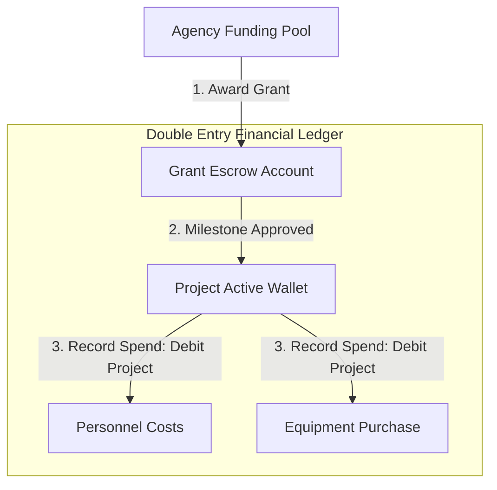

# JIRA Epic & Stories: Funding & Grant Management

This document defines the product and technical details for the Funding & Grant Management module of the Phase 2 Research ERP.

---

## 1. Client Section (Detailed Feature Walkthrough & Real-Time Examples)

### GRANT-001: Grant Opportunity Registry & Eligibility Scopes
*   **Business Explanation:** Funding agencies need a portal to publish funding opportunities, specifying total funding pools, timelines, and application requirements.
*   **How it Works in Real Time:**
    1.  An agency representative logs in and creates a new grant opportunity.
    2.  They specify eligibility criteria (e.g., must be a verified university, minimum TRL level 3).
    3.  The system lists the opportunity on the search board, matching it with eligible projects.
*   **Real-Time Example:** The Department of Science and Technology (DST) publishes a *"Clean Water Initiative Grant 2026"* with a total pool of 30,000,000 INR. The system lists it and sends matching alerts to Kabir's desalinator project.

### GRANT-002: Dynamic Budget Planner & Real-Time Expense Checking
*   **How it Works in Real Time:** Applicants design detailed spreadsheets listing expected expenses (personnel, travel, materials). The backend checks the entries against rules set by the funding agency.
*   **Real-Time Example:** Dr. Sen builds her budget. She tries to enter 600,000 INR for travel. The system rejects it: *"Travel cannot exceed 10% of total budget (300,000 INR maximum)."* She adjusts it, and the system saves her budget worksheet.

### GRANT-003: Double-Entry Financial Ledger Setup
*   **How it Works in Real Time:** To prevent financial fraud, the system records every movement of funds in balancing ledger accounts. Every transaction must have matching debit and credit entries.
*   **Real-Time Example:** The grant is awarded. The platform transfers 3,000,000 INR to the project escrow. The system writes:
    *   *Debit:* `DST-Escrow-101` -> 3,000,000 INR.
    *   *Credit:* `Project-Wallet-Sen` -> 3,000,000 INR.
    *   Both entries share the transaction UUID: `TXN-AWARD-101`.

### GRANT-004: Milestone-Triggered Payout Releases
*   **How it Works in Real Time:** Funds are released incrementally. When a project passes a stage-gate approval, the system triggers the transaction webhook to release the next block of funding from escrow.
*   **Real-Time Example:** The project passes Gate 1. The webhook catches this approval and immediately transfers 1,200,000 INR from the DST Escrow wallet to the active Project Wallet.

### GRANT-005: Financial Audit Logger & Expense Receipts
*   **How it Works in Real Time:** Every purchase made using project funds requires uploading receipts and mapping them to a budget category. External auditors can inspect this timeline in real time.
*   **Real-Time Example:** Dr. Sen buys materials for 200,000 INR. She uploads the invoice. The system debits the Project Wallet and logs the purchase under the "Materials" category. An auditor can view this entry and download the linked invoice file.

---

## 2. Architecture & Flow Diagram

The diagram below details the double-entry bookkeeping ledger flow for research grant allocations and project spend logs:



---

## 3. Technical Implementation Details

### Database Schema (Prisma)
Save as part of your primary schema mapping:

```prisma
model Grant {
  id             String         @id @default(uuid())
  title          String
  description    String
  agencyId       String         
  totalAmount    Float
  deadline       DateTime
  
  // Relations
  applications   GrantApplication[]
}

model GrantApplication {
  id             String           @id @default(uuid())
  grantId        String
  grant          Grant            @relation(fields: [grantId], references: [id], onDelete: Cascade)
  projectId      String
  requestedFunds Float
  budgetBreakdown Json             // [{ category: 'Equipment', amount: 50000 }]
  status         String           @default("SUBMITTED") // SUBMITTED, AWARDED, REJECTED
  
  createdAt      DateTime         @default(now())
}

// Financial Double-Entry Audit Ledger
model LedgerAccount {
  id             String           @id @default(uuid())
  name           String           // e.g. "Grant-Escrow-101", "Project-Wallet-202"
  balance        Float            @default(0.0)
  createdAt      DateTime         @default(now())
  
  entries        LedgerEntry[]
}

model LedgerEntry {
  id             String           @id @default(uuid())
  accountId      String
  account        LedgerAccount    @relation(fields: [accountId], references: [id])
  txnGroupId     String           // UUID linking balancing debit and credit entries
  debit          Float            @default(0.0)
  credit         Float            @default(0.0)
  description    String
  
  createdAt      DateTime         @default(now())
  
  @@index([accountId])
  @@index([txnGroupId])
}
```

### Express Controller: Double-Entry Payout Transaction
Save as `server/src/api/grants/ledger.controller.js` or matching routes:

```javascript
const prisma = require("../../config/prisma");
const catchAsync = require("../../utils/catchAsync");
const AppError = require("../../utils/AppError");
const { v4: uuidv4 } = require("uuid");

exports.releaseMilestoneFunds = catchAsync(async (req, res, next) => {
  const { projectId, milestoneId, amountToRelease } = req.body;

  // 1. Fetch milestone and verify status
  const milestone = await prisma.projectMilestone.findUnique({
    where: { id: milestoneId }
  });

  if (!milestone || milestone.projectId !== projectId) {
    return next(new AppError("Milestone not found or mismatch.", 404));
  }

  if (!milestone.isCompleted) {
    return next(new AppError("Conflict: Milestone must be completed before funding release.", 400));
  }

  // Find associated ledger accounts
  const escrowAccount = await prisma.ledgerAccount.findFirst({
    where: { name: `Escrow-Project-${projectId}` }
  });
  const projectWallet = await prisma.ledgerAccount.findFirst({
    where: { name: `Wallet-Project-${projectId}` }
  });

  if (!escrowAccount || !projectWallet) {
    return next(new AppError("Financial ledger accounts not found.", 404));
  }

  if (escrowAccount.balance < amountToRelease) {
    return next(new AppError("Conflict: Inadequate funds in escrow.", 400));
  }

  // 2. Execute double-entry transfer inside a transaction
  const txnGroupId = uuidv4();

  await prisma.$transaction(async (tx) => {
    // A. Debit Escrow Account
    await tx.ledgerEntry.create({
      data: {
        accountId: escrowAccount.id,
        txnGroupId,
        debit: amountToRelease,
        credit: 0.0,
        description: `Release of funds for Milestone: ${milestone.title}`
      }
    });

    // B. Credit Project Active Wallet
    await tx.ledgerEntry.create({
      data: {
        accountId: projectWallet.id,
        txnGroupId,
        debit: 0.0,
        credit: amountToRelease,
        description: `Received funds from Escrow for Milestone: ${milestone.title}`
      }
    });

    // C. Update Account Balances
    await tx.ledgerAccount.update({
      where: { id: escrowAccount.id },
      data: { balance: { decrement: amountToRelease } }
    });

    await tx.ledgerAccount.update({
      where: { id: projectWallet.id },
      data: { balance: { increment: amountToRelease } }
    });
  });

  res.status(200).json({
    success: true,
    message: "Milestone funds released and ledger updated successfully.",
    data: {
      txnGroupId,
      amountReleased: amountToRelease
    }
  });
});
```

### JSON Payloads
*   **POST** `/api/grants/award` (Request):
    ```json
    {
      "applicationId": "app_grant_88291_uuid",
      "awardAmount": 3000000.0
    }
    ```
*   **POST** `/api/grants/award` (Response):
    ```json
    {
      "success": true,
      "message": "Grant awarded. Escrow and Wallet ledger accounts initialized.",
      "data": {
        "txnGroupId": "txn_award_771bc9",
        "escrowAccountId": "acc_escrow_8821a",
        "projectWalletId": "acc_wallet_9921b"
      }
    }
    ```
