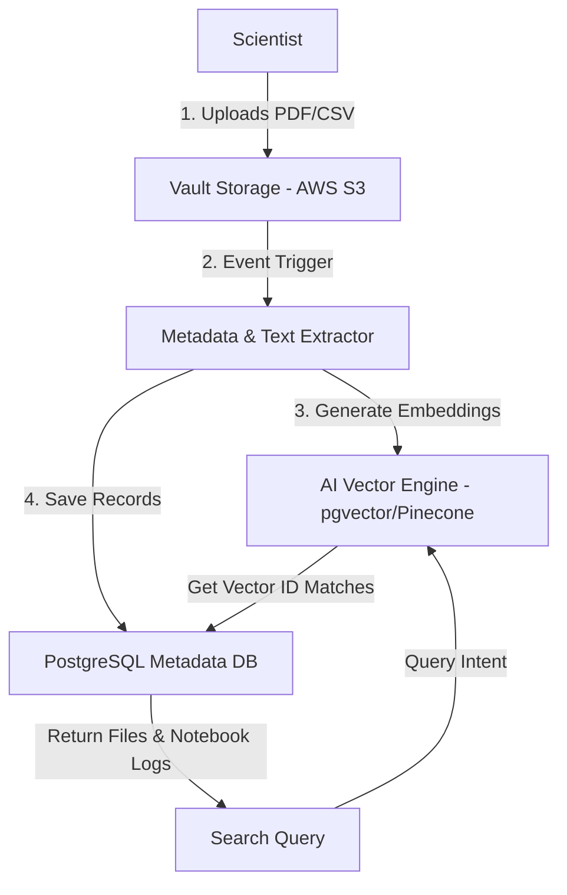

# JIRA Epic & Stories: Knowledge & Research Data Management

This document defines the product and technical details for the Knowledge & Research Data Management module of the Phase 2 Research ERP.

---

## 1. Client Section (Detailed Feature Walkthrough & Real-Time Examples)

### KNOW-001: Central Document Vault & S3 Version Control
*   **Business Explanation:** Research teams generate a large number of drafts, papers, and lab reports. Instead of storing files in unstructured drives, the platform hosts an isolated document vault with automatic version control.
*   **How it Works in Real Time:**
    1.  The user uploads a file to the project's document tab.
    2.  The server routes the payload to AWS S3, tagging the file with the project ID and version number.
    3.  If the user uploads an updated file with the same name, S3 registers it as a new version and updates the version list.
*   **Real-Time Example:** Dr. Sen uploads *"Draft Paper V1.pdf"*. Later, she uploads a revised version. The dashboard displays both files under a version dropdown: `Version 1` and `Version 2`.

### KNOW-002: Large Dataset Ingestion & Multipart S3 Uploads
*   **How it Works in Real Time:** Sensor logs and raw CSV outputs can be hundreds of megabytes. To prevent client timeouts, the portal splits large files into small chunks and uploads them in parallel directly to S3.
*   **Real-Time Example:** Kabir uploads a 200MB dataset. The system splits the upload into 10 separate streams, displaying progress bars for each. Once all chunks arrive, S3 compiles the file and links it to Kabir's active experiment.

### KNOW-003: Electronic Lab Notebook (ELN) & Autosaving Drafts
*   **How it Works in Real Time:** A digital diary where researchers log daily experimental activities, parameters, and observations. The system autosaves drafts in the background.
*   **Real-Time Example:** Kabir opens his notebook and writes: *"Tested sample batch #09. Salt spray settings: 35 degrees C."* He sees a green message: *"Draft autosaved 2 seconds ago."* If his browser crashes, the draft remains safe.

### KNOW-004: Cryptographic Timestamp Locking
*   **How it Works in Real Time:** To prove the exact date of an invention (crucial for patent applications), notebook entries can be locked using SHA-256 encryption. The system creates a hash of the text, author ID, and timestamp, writing it to the database. This acts as legal proof of the priority date.
*   **Real-Time Example:** Kabir clicks "Lock Entry". The system combines his notes, user ID, and the date, running it through a SHA-256 algorithm to generate the code `a1b2c3d4...`. If someone edits the entry later, the hash fails verification, indicating tampering.

### KNOW-005: AI Semantic Search Engine
*   **How it Works in Real Time:** An AI-powered search bar searches inside files using concepts rather than exact words.
*   **Real-Time Example:** A researcher searches *"corrosion resistance in alloys"*. The search engine translates this into concepts and returns Kabir's spreadsheet notes, even though the exact term "corrosion resistance" was not used.

---

## 2. Architecture & Flow Diagram

The diagram below outlines the document processing, metadata indexing, and semantic vector search flow:



---

## 3. Technical Implementation Details

### Database Schema (Prisma)
Save as part of your primary schema mapping:

```prisma
model Document {
  id             String         @id @default(uuid())
  title          String
  s3Key          String         
  s3Url          String
  fileType       String
  version        Int            @default(1)
  isPublic       Boolean        @default(false)
  projectId      String         
  uploaderId     String         
  
  // Relations
  metadataTags   DocumentMetadata[]
  
  createdAt      DateTime       @default(now())
  updatedAt      DateTime       @updatedAt
  
  @@index([projectId])
}

model DocumentMetadata {
  id             String         @id @default(uuid())
  docId          String
  document       Document       @relation(fields: [docId], references: [id], onDelete: Cascade)
  key            String         
  value          String         
}

model LabNotebookEntry {
  id             String         @id @default(uuid())
  title          String
  content        String         
  hashSignature  String         
  projectId      String         
  authorId       String         
  datasetUrl     String?        
  isLocked       Boolean        @default(false)
  
  createdAt      DateTime       @default(now())
  updatedAt      DateTime       @updatedAt
  
  @@index([projectId])
}
```

### Express Controller: Notebook Cryptographic Lock
Save as `server/src/api/knowledge/notebook.controller.js` or matching routes:

```javascript
const prisma = require("../../config/prisma");
const catchAsync = require("../../utils/catchAsync");
const AppError = require("../../utils/AppError");
const crypto = require("crypto");

exports.lockNotebookEntry = catchAsync(async (req, res, next) => {
  const { entryId } = req.params;

  // 1. Fetch current notebook entry
  const entry = await prisma.labNotebookEntry.findUnique({
    where: { id: entryId }
  });

  if (!entry) {
    return next(new AppError("Notebook entry not found.", 404));
  }

  if (entry.authorId !== req.user.id) {
    return next(new AppError("Unauthorized: Only the author can lock this entry.", 403));
  }

  if (entry.isLocked) {
    return next(new AppError("Conflict: Entry is already cryptographically locked.", 400));
  }

  // 2. Generate SHA-256 Signature of the content block to prove priority date
  const hashString = `${entry.title}|${entry.content}|${entry.authorId}|${entry.createdAt.toISOString()}`;
  const hashSignature = crypto.createHash("sha256").update(hashString).digest("hex");

  // 3. Update database record to locked status
  const lockedEntry = await prisma.labNotebookEntry.update({
    where: { id: entryId },
    data: {
      isLocked: true,
      hashSignature
    }
  });

  res.status(200).json({
    success: true,
    message: "Notebook entry locked cryptographically. Priority timestamp secured.",
    data: {
      entryId: lockedEntry.id,
      hashSignature: lockedEntry.hashSignature,
      isLocked: lockedEntry.isLocked
    }
  });
});
```

### JSON Payloads
*   **POST** `/api/knowledge/notebooks` (Request):
    ```json
    {
      "projectId": "proj_alloy_7721a",
      "title": "Cleanroom Run #09 Results",
      "content": "Sputtering chamber pressure: 5x10^-6 Torr. Nitrogen flow rate adjusted.",
      "datasetUrl": "https://dreamxec-vault.s3.amazonaws.com/datasets/run_09_data.csv"
    }
    ```
*   **POST** `/api/knowledge/notebooks` (Response):
    ```json
    {
      "success": true,
      "message": "Notebook draft saved successfully.",
      "data": {
        "entryId": "note_run_09_uuid",
        "isLocked": false
      }
    }
    ```
