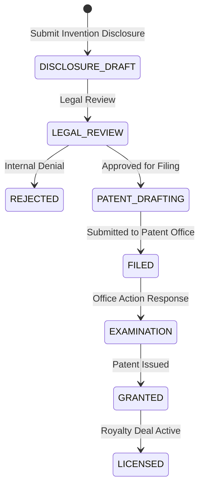

# JIRA Epic & Stories: Intellectual Property Management

This document defines the product and technical details for the Intellectual Property Management module of the Phase 2 Research ERP.

---

## 1. Client Section (Detailed Feature Walkthrough & Real-Time Examples)

### IP-001: Invention Disclosure Forms & Metadata Linkage
*   **Business Explanation:** When research yields a novel device or process, researchers draft an Invention Disclosure describing what the invention is, its technical advantages, and commercial potential.
*   **How it Works in Real Time:**
    1.  The research team fills out the Invention Disclosure questionnaire.
    2.  They link the disclosure directly to the supporting lab notebook logs and datasets.
    3.  The system locks these attachments, preventing them from being edited during the legal review.
*   **Real-Time Example:** Dr. Sen submits a disclosure form titled *"Graphene Nano-Coated Spray Nozzle."* She uploads blueprint diagrams and links the baseline experiment notebook logs as proof.

### IP-002: Dynamic Owner Split Attribution & Digital Consent
*   **Business Explanation:** Inventors agree on how credit and future earnings are split (e.g. 60/40). The system requires all listed inventors to sign off on their dashboards before the proposal can be finalized.
*   **How it Works in Real Time:**
    1.  The lead inventor drafts the split allocation.
    2.  The backend sends verify notifications to all other listed inventors.
    3.  Each inventor logs in, views the allocation split, and clicks "Verify Split."
    4.  If the sum does not equal exactly `100.00%`, the system blocks approval.
*   **Real-Time Example:** Dr. Sen sets the split: `Anita Sen: 60%` and `Kabir: 40%`. Kabir receives an alert, reviews the terms, and clicks "Verify Split." The system locks these percentages.

### IP-003: Patent Application Pipeline Tracker
*   **How it Works in Real Time:** Tracks the legal journey of a patent application through filing checkpoints (Drafting, Filed, Under Review, Granted).
*   **Real-Time Example:** The platform legal advisor approves Dr. Sen's disclosure and submits it to the patent office. The advisor updates the status to `FILED` and inputs filing serial number `US-82910-A`.

### IP-004: Corporate Licensing Agreements
*   **How it Works in Real Time:** Registers contracts leasing the patent to corporations. This outlines flat payments, royalty rates on product sales, and contract dates.
*   **Real-Time Example:** Tata Steel leases the nozzle design. The deal specifies a `2.5%` royalty rate on every nozzle sold and an annual fee of `1,000,000 INR`.

### IP-005: Automated Royalty Splitter
*   **How it Works in Real Time:** The financial ledger processes licensing payments and splits them automatically based on the locked inventor percentages.
*   **Real-Time Example:** Tata Steel pays the 1,000,000 INR annual fee. The system detects the payment and writes:
    *   *Credit:* Dr. Sen's Wallet -> 600,000 INR (60% share).
    *   *Credit:* Kabir's Wallet -> 400,000 INR (40% share).
    Both receive confirmation notifications.

---

## 2. Architecture & Flow Diagram

The diagram below details the patent application stages and legal approval workflows:



---

## 3. Technical Implementation Details

### Database Schema (Prisma)
Save as part of your primary schema mapping:

```prisma
enum PatentStatus {
  DISCLOSURE_DRAFT
  LEGAL_REVIEW
  DRAFTING
  FILED
  EXAMINATION
  GRANTED
  ABANDONED
}

model InventionDisclosure {
  id             String         @id @default(uuid())
  title          String
  abstract       String
  detailedDesc   String
  projectId      String         
  
  // Relations
  attributions   IpAttribution[]
  patentFiles    Patent[]
  
  createdAt      DateTime       @default(now())
  updatedAt      DateTime       @updatedAt
}

model IpAttribution {
  id             String              @id @default(uuid())
  disclosureId   String              
  disclosure     InventionDisclosure @relation(fields: [disclosureId], references: [id], onDelete: Cascade)
  userId         String              
  sharePercentage Float              // e.g. 60.00
  isApproved     Boolean             @default(false)
}

model Patent {
  id             String              @id @default(uuid())
  disclosureId   String              
  disclosure     InventionDisclosure @relation(fields: [disclosureId], references: [id], onDelete: Cascade)
  patentNumber   String?             @unique
  filingDate     DateTime?
  status         PatentStatus        @default(DISCLOSURE_DRAFT)
  licensingDeals LicensingAgreement[]
}

model LicensingAgreement {
  id             String              @id @default(uuid())
  patentId       String              
  patent         Patent              @relation(fields: [patentId], references: [id], onDelete: Cascade)
  licenseeName   String              
  royaltyRate    Float               
  paymentTerms   String
  createdAt      DateTime            @default(now())
}
```

### Express Controller: Automated Royalty Distribution Splitter
Save as `server/src/api/ip/royalty.controller.js` or matching routes:

```javascript
const prisma = require("../../config/prisma");
const catchAsync = require("../../utils/catchAsync");
const AppError = require("../../utils/AppError");
const { v4: uuidv4 } = require("uuid");

exports.disburseRoyaltyPayment = catchAsync(async (req, res, next) => {
  const { agreementId, incomingAmount } = req.body;

  // 1. Fetch Licensing Agreement & linked patent attributions
  const agreement = await prisma.licensingAgreement.findUnique({
    where: { id: agreementId },
    include: {
      patent: {
        include: {
          disclosure: {
            include: { attributions: true }
          }
        }
      }
    }
  });

  if (!agreement) {
    return next(new AppError("Licensing agreement not found.", 404));
  }

  const attributions = agreement.patent.disclosure.attributions;

  // Verify all attributions are signed off
  const unapproved = attributions.some(a => !a.isApproved);
  if (unapproved) {
    return next(new AppError("Conflict: Cannot process royalties. Inventors have not verified their attribution splits.", 400));
  }

  const txnGroupId = uuidv4();

  // 2. Perform splitting payouts inside transaction
  await prisma.$transaction(async (tx) => {
    // A. Debit Licensee Account
    await tx.ledgerEntry.create({
      data: {
        accountId: req.body.licenseeAccountId, // Input account parameter
        txnGroupId,
        debit: incomingAmount,
        credit: 0.0,
        description: `Royalty payment for License: ${agreement.id}`
      }
    });

    // B. Distribute splits to each inventor's wallet account
    for (const author of attributions) {
      const shareAmount = (incomingAmount * author.sharePercentage) / 100.00;
      
      // Locate or create user wallet account
      const walletAccount = await tx.ledgerAccount.findFirst({
        where: { name: `Wallet-User-${author.userId}` }
      });

      if (!walletAccount) {
        throw new Error(`MISSING_USER_WALLET_${author.userId}`);
      }

      await tx.ledgerEntry.create({
        data: {
          accountId: walletAccount.id,
          txnGroupId,
          debit: 0.0,
          credit: shareAmount,
          description: `Royalty split (${author.sharePercentage}%) from License: ${agreement.id}`
        }
      });

      await tx.ledgerAccount.update({
        where: { id: walletAccount.id },
        data: { balance: { increment: shareAmount } }
      });
    }
  });

  res.status(200).json({
    success: true,
    message: "Royalty split payment disbursed successfully.",
    data: { txnGroupId }
  });
});
```

### JSON Payloads
*   **POST** `/api/ip/disclosures` (Request):
    ```json
    {
      "projectId": "proj_alloy_7721a",
      "title": "Graphene Nano-Coated Spray Nozzle",
      "abstract": "A spray nozzle designed for graphene-coating applications.",
      "detailedDesc": "Utilizes micro-jets to align graphene sheets.",
      "attributions": [
        { "userId": "usr_sen_88291a", "sharePercentage": 60.0 },
        { "userId": "usr_kabir_9921b", "sharePercentage": 40.0 }
      ]
    }
    ```
*   **POST** `/api/ip/disclosures` (Response):
    ```json
    {
      "success": true,
      "message": "Invention disclosure filed. Inventors notified to verify split.",
      "data": {
        "disclosureId": "disc_nozzle_8821a"
      }
    }
    ```
