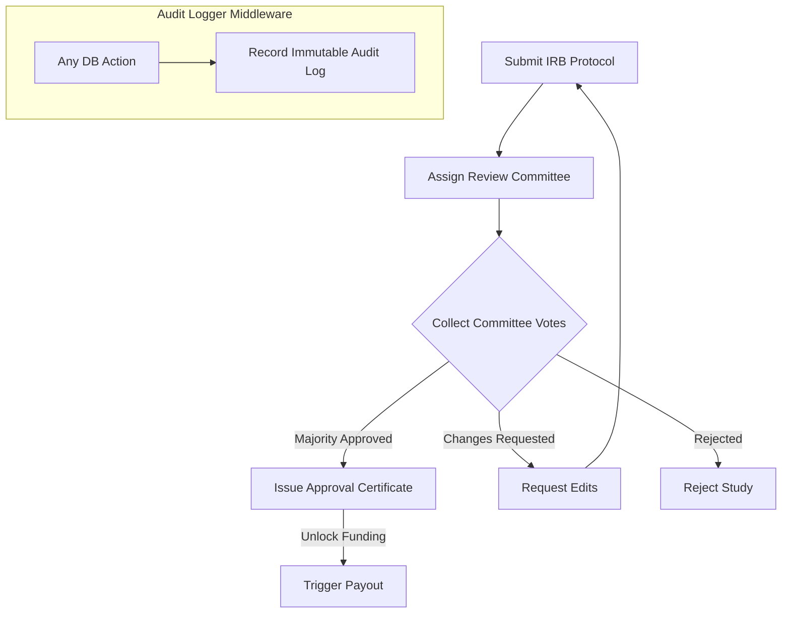

# JIRA Epic & Stories: Compliance & Governance

This document defines the product and technical details for the Compliance & Governance module of the Phase 2 Research ERP.

---

## 1. Client Section (Detailed Feature Walkthrough & Real-Time Examples)

### COMP-001: IRB Ethics Protocol Submissions & Questionnaires
*   **Business Explanation:** Studies involving humans or safety parameters require an Institutional Review Board (IRB) protocol. Researchers write study outlines and declare risk profiles.
*   **How it Works in Real Time:**
    1.  The user opens the IRB submission form.
    2.  They fill out risk assessment questionnaire sections.
    3.  They attach files detailing the test guidelines, patient consent sheets, or materials safety data sheets (MSDS).
*   **Real-Time Example:** Dr. Sen drafts a study to test graphene alloy wear on human prosthetic joints. She selects **Medium Risk** and submits the protocol, attaching patient information sheets.

### COMP-002: Committee Voting & Review Workflows
*   **How it Works in Real Time:** Protocols are sent to committee members who vote (Approve, Request Changes, Reject) and add feedback comments.
*   **Real-Time Example:** The portal assigns three board members to review Dr. Sen's protocol. Member A and B vote `APPROVE`. Member C requests edits. With a majority of two approval votes, the system updates the status to `APPROVED` and generates a certificate.

### COMP-003: Immutable System Audit Logs
*   **How it Works in Real Time:** The database monitors all major actions, logging user IDs, action names, target models, timestamps, and IP addresses. These logs are write-only, protecting files from tampering.
*   **Real-Time Example:** A researcher tries to edit the budget on an active project. The audit log middleware intercepts the save query, writes a log record (`action: PROJECT_BUDGET_EDITED`, `user: Amit`, `IP: 192.168.1.5`), and proceeds. Auditors can view this history list to confirm accountability.

### COMP-004: Lab Safety & Compliance Incident Reports
*   **How it Works in Real Time:** If a safety violation or cleanroom incident occurs, researchers can submit a report. The system immediately locks affected hardware schedules and sends urgent alerts.
*   **Real-Time Example:** Kabir reports a chemical exhaust failure in Cleanroom B. He files an Incident Report. The system instantly locks room reservation calendar `Cleanroom-B` to `MAINTENANCE` and notifies the safety officer.

---

## 2. Architecture & Flow Diagram

The diagram below outlines the ethics protocol submission, vote review, and approval flow:



---

## 3. Technical Implementation Details

### Database Schema (Prisma)
Save as part of your primary schema mapping:

```prisma
enum IRBStatus {
  DRAFT
  SUBMITTED
  UNDER_REVIEW
  APPROVED
  REVISION_REQUESTED
  REJECTED
}

model IrbProtocol {
  id             String         @id @default(uuid())
  title          String
  riskLevel      String         // LOW, MEDIUM, HIGH
  description    String
  status         IRBStatus      @default(DRAFT)
  projectId      String         
  submitterId    String         
  
  // Relations
  votes          IrbVote[]
  
  createdAt      DateTime       @default(now())
  updatedAt      DateTime       @updatedAt
}

model IrbVote {
  id             String         @id @default(uuid())
  protocolId     String
  protocol       IrbProtocol    @relation(fields: [protocolId], references: [id], onDelete: Cascade)
  voterId        String
  vote           String         // APPROVE, REJECT, REQUEST_REVISIONS
  comments       String?
  
  createdAt      DateTime       @default(now())
}

// Immutable System-Wide Audit Log
model AuditLog {
  id             String         @id @default(uuid())
  action         String         
  performedBy    String         
  targetId       String?        
  targetModel    String?        
  ipAddress      String?
  payload        Json?          
  
  createdAt      DateTime       @default(now())
  
  @@index([performedBy])
  @@index([targetModel, targetId])
}
```

### Express Controller: IRB Protocol Compiler (Voting Aggregator)
Save as `server/src/api/compliance/irb.controller.js` or matching routes:

```javascript
const prisma = require("../../config/prisma");
const catchAsync = require("../../utils/catchAsync");
const AppError = require("../../utils/AppError");

exports.submitIrbVote = catchAsync(async (req, res, next) => {
  const { protocolId } = req.params;
  const { voteDecision, comments } = req.body; // "APPROVE", "REJECT", "REVISION"
  const reviewerId = req.user.id;

  // 1. Check protocol and existing votes
  const protocol = await prisma.irbProtocol.findUnique({
    where: { id: protocolId },
    include: { votes: true }
  });

  if (!protocol) {
    return next(new AppError("IRB Protocol not found.", 404));
  }

  if (protocol.status !== "UNDER_REVIEW") {
    return next(new AppError("Conflict: Protocol must be under active review to accept votes.", 400));
  }

  // 2. Write vote and update status if complete
  const result = await prisma.$transaction(async (tx) => {
    // A. Write vote entry
    await tx.irbVote.create({
      data: {
        protocolId,
        voterId: reviewerId,
        vote: voteDecision,
        comments: comments || null
      }
    });

    const activeVotes = [...protocol.votes, { voterId: reviewerId, vote: voteDecision }];

    // Suppose a target board of 3 members is required to reach a decision
    if (activeVotes.length >= 3) {
      const approveCount = activeVotes.filter(v => v.vote === "APPROVE").length;
      const rejectCount = activeVotes.filter(v => v.vote === "REJECT").length;
      
      let finalStatus = "APPROVED";
      if (rejectCount > 0) {
        finalStatus = "REJECTED";
      } else if (approveCount < 2) {
        // If majority is not met
        finalStatus = "REVISION_REQUESTED";
      }

      return await tx.irbProtocol.update({
        where: { id: protocolId },
        data: { status: finalStatus }
      });
    }

    return protocol;
  });

  res.status(200).json({
    success: true,
    message: "Vote recorded successfully.",
    data: {
      protocolStatus: result.status
    }
  });
});
```

### JSON Payloads
*   **POST** `/api/compliance/protocols` (Request):
    ```json
    {
      "projectId": "proj_alloy_7721a",
      "title": "Human wear test: Prosthetic components",
      "riskLevel": "HIGH",
      "description": "Frictional testing of graphene composite joints."
    }
    ```
*   **POST** `/api/compliance/protocols` (Response):
    ```json
    {
      "success": true,
      "message": "Protocol submitted. Status set to SUBMITTED.",
      "data": {
        "protocolId": "proto_irb_7712a",
        "status": "SUBMITTED"
      }
    }
    ```
