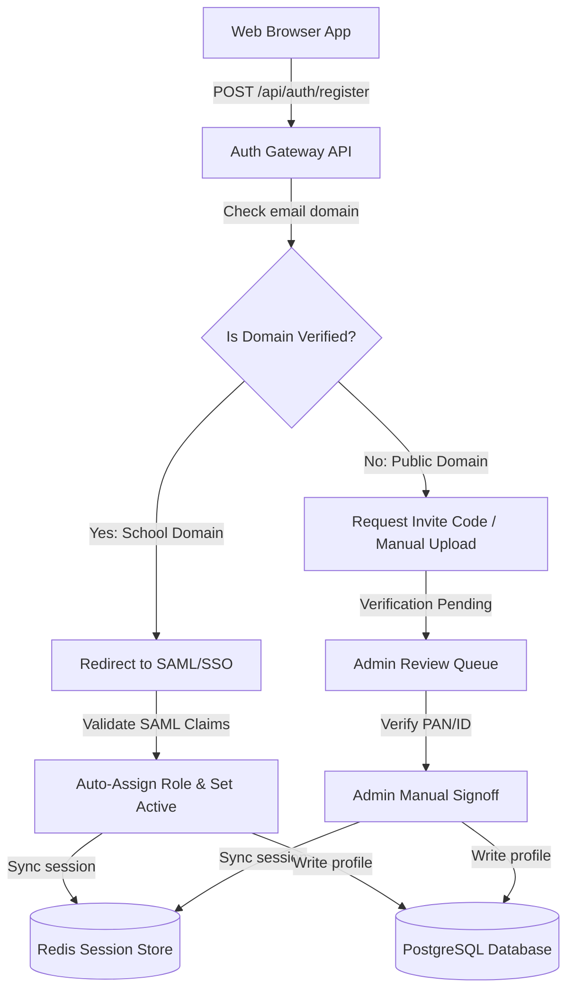
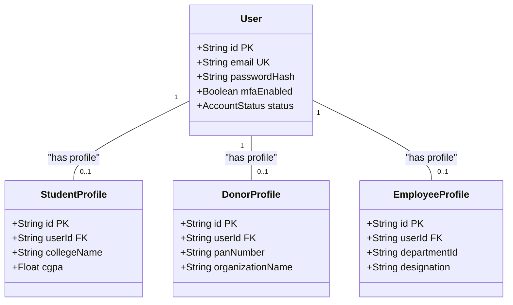

# Enterprise Research ERP: Comprehensive Onboarding & Identity Architecture Plan

This document outlines the system-wide architecture and step-by-step onboarding, validation, and role-based gating workflows for every user persona in the Phase 2 Research ERP. It provides the technical database schema transitions, API specifications, and visual Mermaid diagrams to guide both developers and Atlassian Rovo page generation tools.

---

## 1. Glossary of Terms (Acronyms & Full Forms)

To ensure this document is easily understood by clients, designers, and developers, here are the definitions and full forms of all technical terms:
*   **ERP:** **Enterprise Resource Planning** (A centralized software system to manage all business, research, financial, and database operations).
*   **RBAC:** **Role-Based Access Control** (A security method that grants permissions to users based on their broad job roles).
*   **PBAC:** **Permission-Based Access Control** (A granular security method that checks specific action keys, like `project:edit`, instead of broad roles).
*   **SSO:** **Single Sign-On** (An authentication scheme allowing a user to log in with a single ID to multiple independent systems).
*   **MFA:** **Multi-Factor Authentication** (A security check requiring two or more verification factors, such as a password and a phone code, to log in).
*   **TOTP:** **Time-Based One-Time Password** (A temporary passcode generated by an app, like Google Authenticator, which changes every 30 seconds).
*   **SAML:** **Security Assertion Markup Language** (An XML-based open standard for exchanging login details between systems).
*   **LDAP:** **Lightweight Directory Access Protocol** (A standard protocol used to look up user credentials in active institutional directories).
*   **ADFS:** **Active Directory Federation Services** (A Microsoft software component providing secure single sign-on capabilities).
*   **JWT:** **JSON Web Token** (A secure internet standard used to send information safely between a client browser and a server).
*   **KYC:** **Know Your Customer** (The mandatory legal process of identifying and verifying the identity of a user or company).
*   **PAN:** **Permanent Account Number** (A unique ten-character alphanumeric identifier issued by the Indian Income Tax Department).
*   **EIN:** **Employer Identification Number** (A unique nine-digit corporate tax number assigned by the Internal Revenue Service in the US).
*   **NSDL:** **National Securities Depository Limited** (The Indian central registry hosting the official PAN database verification APIs).
*   **AML:** **Anti-Money Laundering** (A set of legal regulations preventing criminals from disguising illegally obtained funds).
*   **MoU:** **Memorandum of Understanding** (A signed bilateral or multilateral agreement establishing an official partnership).
*   **PI:** **Principal Investigator** (The lead professor or scientist in charge of a research grant project).
*   **IRB:** **Institutional Review Board** (An ethics committee that reviews research involving human subjects).
*   **S3:** **Simple Storage Service** (Amazon Web Services' secure cloud storage directory for documents and images).
*   **TRL:** **Technology Readiness Level** (A 9-step scale estimating the maturity and commercial readiness of a technology).
*   **SDG:** **Sustainable Development Goals** (A collection of 17 global goals set by the United Nations for environmental and social development).
*   **CGPA:** **Cumulative Grade Point Average** (The standard grading metric evaluating a student's total academic score).
*   **CSR:** **Corporate Social Responsibility** (A business model where corporations invest a portion of profits back into social and research programs).

---

## 2. System Architecture & Flows

The unified onboarding architecture channels registrations into specific verification flows:



### Authentication Architecture (Current Split vs. Target ERP)

#### The Current Split-Table Issue:
In your current codebase, authentication is divided across two distinct database models:
1.  `User` table (handles students, club presidents, and platform admins).
2.  `Donor` table (handles individual and corporate sponsors, duplicating login credentials).

Because authentication is split, the authentication server is forced to run redundant queries in sequence on every request. As seen in [auth.middleware.js](file:///c:/ongoing_works/codes/Dreamxec/server/src/middleware/auth.middleware.js#L73-L80):
```javascript
// Query User table first
let currentUser = await prisma.user.findUnique({ where: { id: decoded.id } });

if (!currentUser) {
  // If not found in User, run a second database query on the Donor table
  currentUser = await prisma.donor.findUnique({ where: { id: decoded.id } });
  if (currentUser) currentUser.role = 'DONOR';
}
```
Under concurrent traffic (like 60+ onboarding users), this double-query lookup quickly exhausts database connection limits, leading to timeouts and server crashes.

#### The Unified Target Solution:
We combine all user types into a single database table:
*   All users register in the same `User` table.
*   The system executes a single query check to retrieve their login session and permissions, increasing page speeds and saving database connection pools.
*   Specialized fields (like student CGPA or corporate tax PAN) are stored in 1:1 linked profile tables, keeping the core user records clean.



---

## 3. Onboarding Specifications by Role

---

### A. Student / Researcher (`STUDENT` / `RESEARCHER`)

#### Business Goals:
Ensure that student researchers belong to a verified institution and are authorized to access project workspaces, without creating manual bottlenecks for administrators.

#### Verification Workflows:
1.  **Direct Email Check:** The student signs up with their university email (`student@iitd.ac.in`).
2.  **Verify Code:** The system sends an email verification code.
3.  **Automated Verification (Preferred):**
    *   The system checks the `ClubMember` pre-uploaded email directory (pre-populated by verified Club Presidents).
    *   If the email matches, the account is set to `ACTIVE` and `studentVerified: true` automatically.
4.  **Manual ID Upload (Fallback):**
    *   If the email is not in the club list, the student uploads a photo scan of their Student ID Card.
    *   The request is routed to the University Admin queue.
    *   The admin reviews the card image and clicks "Approve", promoting the user to `ACTIVE`.

#### Database Models (Prisma):
```prisma
model StudentProfile {
  id           String   @id @default(uuid())
  userId       String   @unique
  user         User     @relation(fields: [userId], references: [id], onDelete: Cascade)
  collegeName  String
  studentIdCard String?  // S3 File URL
  cgpa         Float?
  skills       String[]
}
```

#### API Endpoint Specifications:
*   **POST** `/api/auth/register/student`
    *   *Body:*
        ```json
        {
          "email": "amit@iitd.ac.in",
          "password": "Password123!",
          "collegeName": "IIT Delhi"
        }
        ```
    *   *Response (Auto-Verified):*
        ```json
        {
          "success": true,
          "status": "ACTIVE",
          "message": "Onboarded successfully. Club membership matched."
        }
        ```
    *   *Response (Pending Review):*
        ```json
        {
          "success": true,
          "status": "UNDER_REVIEW",
          "message": "Please upload a photo of your Student ID Card to complete verification."
        }
        ```

---

### B. Professor / Principal Investigator (`PROFESSOR`)

#### Business Goals:
Verify that the user is a legitimate faculty member authorized to manage research budgets, approve milestones, and act as a Principal Investigator (PI).

#### Verification Workflows:
1.  **SAML/SSO Directory Mapping (Automated):**
    During SSO login, the university's Identity Provider (IdP) sends a signed assertion payload. The server parses the `employeeType` claim. If it equals `"faculty"`, the `PROFESSOR` role is automatically verified and activated.
2.  **Bulk Invitation Tokens:**
    University Deans can upload a faculty list. The server generates a JWT containing `{ email, role: "PROFESSOR", orgId }` signed with a system invite secret. Clicking this link bypasses all review gates.
3.  **Web Crawler Profile Match (Manual Fallback):**
    If self-registering manually, the professor submits their official university profile page URL. The compliance officer checks the URL against the school staff directory and clicks "Approve".

#### Database Models (Prisma):
```prisma
model EmployeeProfile {
  id           String   @id @default(uuid())
  userId       String   @unique
  user         User     @relation(fields: [userId], references: [id], onDelete: Cascade)
  departmentId String
  designation  String   // e.g. "Professor", "Associate Researcher"
  publications String[]
}
```

#### API Endpoint Specifications:
*   **POST** `/api/auth/register/professor`
    *   *Body:*
        ```json
        {
          "email": "anita.sen@iitd.ac.in",
          "password": "Password123!",
          "inviteToken": "optional_jwt_token_here"
        }
        ```
    *   *Response (Invite Approved):*
        ```json
        {
          "success": true,
          "status": "ACTIVE",
          "token": "signed_jwt_access_token_here"
        }
        ```

---

### C. Individual Sponsor (`DONOR`)

#### Business Goals:
Enable donors to fund projects while complying with Anti-Money Laundering (AML) laws and issuing tax exemption certificates.

#### Verification Workflows:
1.  **OAuth Registration:** The donor signs up using Google or LinkedIn OAuth.
2.  **Tax ID Verification:** To receive tax-deduction receipts, they submit their Tax ID (PAN in India, SSN/TIN in the US). The server executes an API call to the national tax registry (e.g. NSDL PAN API) to verify that the name matches.
3.  **Doubtful Activity / Escrow Holds:** Single donations exceeding 50,000 INR are held in escrow pending verification checks.

#### Database Models (Prisma):
```prisma
model DonorProfile {
  id               String   @id @default(uuid())
  userId           String   @unique
  user             User     @relation(fields: [userId], references: [id], onDelete: Cascade)
  panNumber        String?  @unique
  organizationName String?
  isTaxVerified    Boolean  @default(false)
}
```

#### API Endpoint Specifications:
*   **POST** `/api/auth/donor/verify-tax`
    *   *Body:* `{ "panNumber": "ABCDE1234F", "legalName": "Sanjay Kumar" }`
    *   *Response:*
        ```json
        {
          "success": true,
          "isTaxVerified": true,
          "message": "PAN verified against NSDL records."
        }
        ```

---

### D. Corporate Sponsor / R&D Manager (`CORPORATE_ADMIN`)

#### Business Goals:
Ensure that the user represents a verified corporate entity authorized to allocate CSR grant budgets and sign MoUs.

#### Verification Workflows:
1.  **Corporate Domain Lock:** Signup is restricted to corporate domains (e.g., `@tatasteel.com`). Public domains (e.g., `@gmail.com`) are rejected.
2.  **EIN/Tax Registry Validation:** The manager enters the Corporate Tax ID (EIN or Corporate PAN) and uploads their company authorization letter. The platform admin verifies these records before activation.
3.  **Active Status:** Once verified, the manager can allocate corporate CSR grant pools to universities.

#### API Endpoint Specifications:
*   **POST** `/api/auth/register/corporate`
    *   *Body:* `{ "email": "rahul@tatasteel.com", "taxId": "CorporatePAN123", "companyName": "Tata Steel" }`
    *   *Response:*
        ```json
        {
          "success": true,
          "status": "UNDER_REVIEW",
          "message": "Corporate request submitted. We will verify your credentials within 24 hours."
        }
        ```

---

### E. Compliance Officer (`COMPLIANCE_OFFICER`)

#### Business Goals:
Provide independent audit and ethics oversight for research studies, ensuring protocols are approved in a legally compliant manner.

#### Verification Workflows:
1.  **Admin Provisioning:** The account is created by the University Director or Super-Admin.
2.  **Cryptographic Key Pairing:** On first login, the system generates an `Ed25519` key pair. The private key is encrypted and saved, while the public key is stored in the database.
3.  **Protocol Review Queue:** The officer is routed to the ethics review queue to monitor and approve IRB protocols.

#### Database Models (Prisma):
```prisma
model ComplianceProfile {
  id           String   @id @default(uuid())
  userId       String   @unique
  user         User     @relation(fields: [userId], references: [id], onDelete: Cascade)
  publicKey    String   // Ed25519 public key
  officerCode  String   @unique
}
```

---

### F. Platform Super-Administrator (`ADMIN`)

#### Business Goals:
System-wide database management, organization approval routing, and security audits.

#### Verification Workflows:
1.  **Terminal Seeding:** Admin accounts cannot be registered from the public web interface. They are created via secure console scripts.
2.  **Security Gating:** Requires mandatory multi-factor authentication (MFA) and is restricted to corporate IP address ranges.
3.  **Immutable Logs:** Every admin action is logged in the `AuditLog` table.

#### Express Middleware: IP-Range Gating
```javascript
const permittedIpBlocks = ["127.0.0.1", "192.168.1.0/24"];

exports.gateAdminIp = (req, res, next) => {
  const clientIp = req.ip;
  if (!isIpInBlock(clientIp, permittedIpBlocks)) {
    return res.status(403).json({ error: "Access Denied: Unrecognized IP Location" });
  }
  next();
};
```

---

## 4. Database Migration Plan (NoSQL to PostgreSQL)

To migrate your existing data from the split MongoDB collections to the unified PostgreSQL database without data loss, follow this step-by-step pipeline:

```
Step 1: Export raw MongoDB documents (User + Donor).
Step 2: Clean and validate emails, resolving duplicate emails by merging records.
Step 3: Run target PostgreSQL DDL schema scripts.
Step 4: Execute migration script (Backfill).
Step 5: Verify indices, foreign key references, and constraints.
```

### Migration Backfill Script (Conceptual JS)
Save as a scratch script at [scratch/migrate-users.js](file:///c:/ongoing_works/codes/Dreamxec/scratch/migrate-users.js):

```javascript
const { MongoClient } = require("mongodb");
const { Client } = require("pg");

async function migrateData() {
  const mongoClient = await MongoClient.connect("mongodb://localhost:27017");
  const pgClient = new Client({ connectionString: "postgresql://postgres@localhost:5432/dreamxec" });
  await pgClient.connect();

  const mongoDb = mongoClient.db("dreamxec_mongo");
  
  // 1. Fetch all raw users from MongoDB
  const oldUsers = await mongoDb.collection("User").find({}).toArray();
  for (const user of oldUsers) {
    // Insert into unified PG User table
    await pgClient.query(
      "INSERT INTO users (id, email, password_hash, role) VALUES ($1, $2, $3, $4)",
      [user._id.toString(), user.email, user.password, "STUDENT"]
    );
    // Create StudentProfile
    await pgClient.query(
      "INSERT INTO student_profiles (user_id, college_name) VALUES ($1, $2)",
      [user._id.toString(), user.college]
    );
  }

  // 2. Fetch all raw donors from MongoDB
  const oldDonors = await mongoDb.collection("Donor").find({}).toArray();
  for (const donor of oldDonors) {
    // Check if email already exists in unified table (de-duplication)
    const exists = await pgClient.query("SELECT id FROM users WHERE email = $1", [donor.email]);
    if (exists.rows.length > 0) {
      // Merge: link profile to existing user account
      await pgClient.query(
        "INSERT INTO donor_profiles (user_id, pan_number, organization_name) VALUES ($1, $2, $3)",
        [exists.rows[0].id, donor.panNumber, donor.organizationName]
      );
    } else {
      // Create new user and profile
      const newUserId = donor._id.toString();
      await pgClient.query(
        "INSERT INTO users (id, email, password_hash, role) VALUES ($1, $2, $3, $4)",
        [newUserId, donor.email, donor.password, "DONOR"]
      );
      await pgClient.query(
        "INSERT INTO donor_profiles (user_id, pan_number, organization_name) VALUES ($1, $2, $3)",
        [newUserId, donor.panNumber, donor.organizationName]
      );
    }
  }

  await mongoClient.close();
  await pgClient.end();
  console.log("Migration complete.");
}
```
