# Architectural Refactoring Blueprint: Transitioning DreamXec to an Enterprise ERP

This document outlines structural, database, and architectural refactoring strategies to prepare the DreamXec codebase for its transition into a high-scale, reliable, and auditable Enterprise Resource Planning (ERP) platform in Phase 2.

---

## 1. Unified Identity & Polymorphic Profile Schema

### The Current Issue
The database contains separate schemas for `User` and `Donor` accounts:
*   Authentication middleware (`auth.middleware.js`) has to search both collections (`prisma.user.findUnique` followed by a fallback to `prisma.donor.findUnique`).
*   Verification tokens, password resets, and profile completion flags are duplicated in both models.
*   This structure invites email/ID collisions and complicates relations (e.g. comments, project ownership, or transactions).

### ERP Refactoring Blueprint
Consolidate authentication into a single `users` table, and use polymorphic profiles for different user types:
1.  **Unified Authentication Model:** All login credentials, roles, OAuth IDs, and system status belong to the `User` model.
2.  **Separate Profile Tables:** User-specific details live in 1:1 linked tables (`StudentProfile`, `DonorProfile`, `AdminProfile`).

```mermaid
erDiagram
    USER ||--o| STUDENT_PROFILE : "has_one (1:1)"
    USER ||--o| DONOR_PROFILE : "has_one (1:1)"
    USER ||--o| SYSTEM_ROLES : "belongs_to (M:N)"
    
    USER {
        string id PK
        string email UK
        string password_hash
        string main_role
        boolean is_active
    }
    STUDENT_PROFILE {
        string id PK
        string user_id FK
        string college
        string year_of_study
        string skills
    }
    DONOR_PROFILE {
        string id PK
        string user_id FK
        string organization_name
        string pan_number
        string preferences
    }
```



---

## 2. Transition from MongoDB to Relational SQL (PostgreSQL)

### The Current Issue
ERP platforms manage sensitive financial ledgers, invoice matching, and access controls that depend on strict ACID compliance and referential integrity.
*   The current schema uses MongoDB. Because NoSQL lacks database-level foreign key constraints, orphaned rows can occur.
*   Relations like `clubIds String[]` in `User` store arrays of ObjectIds directly in documents, making index checks, joins, and cascading deletes highly error-prone.

### ERP Refactoring Blueprint
Migrate the primary datasource to **PostgreSQL**:
*   **Enforce Foreign Keys:** Replace array relations with explicit junction tables (e.g. `UserClubs` containing composite primary keys of `userId` and `clubId`, plus the user's role inside that specific club).
*   **Structured Fields:** Avoid generic `Json` fields (e.g., `teamMembers Json?` or `colleges Json?`) where query filters or relational constraints are required. Define them as proper tables (e.g., `TeamMember` table) to maintain query efficiency and constraints.

---

## 3. Financial Auditing: Double-Entry Ledger System

### The Current Issue
Currently, campaigns increment total funds raised directly in the project object:
```javascript
amountRaised: { increment: donation.amount }
```
In an ERP context, this is a major compliance risk. Direct updates are prone to race conditions, offer no audit logs (making it impossible to track historic financial state), and fail to track debits versus credits.

### ERP Refactoring Blueprint
Implement a **Double-Entry Ledger Pattern**:
1.  **Accounts:** Create ledger accounts for each entity (e.g., `DonorWallet`, `CampaignEscrow`, `SystemRevenue`).
2.  **Transactions:** A single balance adjustment must consist of at least two ledger entry rows:
    *   **Debit:** Source account decreases.
    *   **Credit:** Destination account increases.
3.  **Audit Trail:** Ledger rows are immutable. Balances are derived dynamically by summing entries or caching them via ledger triggers.

```
Example Ledger Flow (1,000 INR Donation to Campaign A):
┌───────────┬────────────────────┬───────────┬───────────┐
│ Entry ID  │ Ledger Account     │ Debit (-) │ Credit (+)│
├───────────┼────────────────────┼───────────┼───────────┤
│ TXN-101-A │ Donor_99           │ 1000.00   │ 0.00      │
│ TXN-101-B │ Campaign_A_Escrow  │ 0.00      │ 1000.00   │
└───────────┴────────────────────┴───────────┴───────────┘
```

---

## 4. Fine-Grained Permission-Based Access Control (PBAC)

### The Current Issue
Roles are hardcoded enums checked using `restrictTo('ADMIN', 'STUDENT_PRESIDENT')`. An ERP requires dynamic permissions. For example, a "Finance Operator" needs access to process payouts but must not be able to delete projects.

### ERP Refactoring Blueprint
Implement Permission-Based Access Control:
*   Define specific **Permissions** (e.g., `project:verify`, `milestone:approve`, `payout:trigger`).
*   Map permissions to **Roles** in the database.
*   Replace role check middleware with permission check middleware:
    ```javascript
    app.post("/api/admin/payouts", 
      protect, 
      requirePermission("payout:trigger"), 
      triggerPayoutController
    );
    ```

---

## 5. Domain-Driven Design (DDD) Service Layer

### The Current Issue
The controllers handle everything: parsing headers, input validation, raw database calls, emitting event hooks, sending alerts, and formatting responses. This results in bloated files (e.g., `admin.controller.js` is over 1,300 lines) which are difficult to test.

### ERP Refactoring Blueprint
Enforce a clear separation of concerns in each API module:
1.  **Controller Layer:** Handles HTTP request parsing, runs Zod/Joi schemas for input validation, and maps results to HTTP responses.
2.  **Service Layer:** Implements business logic (computations, verification states, external integrations). **No Express imports or Express objects here.**
3.  **Repository Layer (Prisma wrapper):** Abstracts raw queries, isolation levels, and model access.

```
Request ──> Router ──> Controller ──> Service ──> Repository ──> Database
```

---

## 6. Frontend Refactoring: State Management & Code Splitting

### The Current Issue
`client/src/App.tsx` has grown to **2,081 lines**. It holds all route definitions, global states, loading animations, state effects, mapping functions, and auth context initializers.
*   **Monolithic Bundle:** Loading the website fetches the entire admin and president panels on the initial landing page, slowing down load times.
*   **Prop-Drilling:** Global variables are drilled down multiple levels, causing unnecessary re-renders.

### ERP Refactoring Blueprint
1.  **State Management (Zustand):** Separate app state into focused stores (e.g., `useAuthStore`, `useCampaignStore`).
2.  **Modular Routing:** Extract route configurations to a dedicated file using **React Router (v6/v7)** or **TanStack Router**.
3.  **Lazy Loading (Code Splitting):** Wrap dashboard panels in `React.lazy` and `Suspense` so they are loaded dynamically:
    ```typescript
    const AdminDashboard = React.lazy(() => import("./components/admin/AdminDashboard"));
    const PresidentDashboard = React.lazy(() => import("./components/president/PresidentDashboard"));
    ```

---

## 7. Type-Safe Monorepo Setup (TypeScript Backend)

### The Current Issue
The frontend is written in TypeScript, but the backend is written in JavaScript. Developers must manually write matching interfaces and type declarations in the client directory, requiring mapper utilities to format raw payload differences.

### ERP Refactoring Blueprint
Convert the Express server to TypeScript and bundle the codebase into a monorepo (using **pnpm workspaces** or **npm workspaces**):
*   **Shared Contract Layer:** Create a shared package containing Zod validators, error classes, and DTO interfaces.
*   **Schema Synchronization:** Share models directly from Prisma typings, eliminating translation wrappers.

---

## 8. Database Indexing, Schema Optimization & Load Crash Mitigation (60+ Users Concurrent)

During testing, the onboarding process crashed when 60 concurrent users were onboarded. Analysis of the current schema, connection patterns, and event dispatch logic reveals three specific performance bottlenecks. Implementing these optimization rules is critical for the stability of the Phase 2 ERP:

### A. Database Connection Pool Starvation
*   **The Issue:** Several controllers (such as [wishlist.controller.js](file:///c:/ongoing_works/codes/Dreamxec/server/src/api/wishlist/wishlist.controller.js) and [joinRequest.controller.js](file:///c:/ongoing_works/codes/Dreamxec/server/src/api/clubs/joinRequest.controller.js)) import `PrismaClient` and instantiate `new PrismaClient()` at the top of the file. Under concurrent traffic (e.g. 60+ users), this spawns multiple separate connection pools, quickly exceeding MongoDB's maximum connection limits, causing connection refusals and application-wide crashes.
*   **Optimized Solution:** Ensure all controllers import the application-wide Prisma client singleton located in [config/prisma.js](file:///c:/ongoing_works/codes/Dreamxec/server/src/config/prisma.js) rather than instantiating new clients. In Phase 2, connect to PostgreSQL via **PgBouncer** or utilize Prisma's built-in connection limits (`?connection_limit=10`) to enforce a query connection cap.

### B. Missing Query Indexes & Collection Scans
*   **The Issue:** User registration automatically triggers updates to guest records:
    ```javascript
    await prisma.donation.updateMany({
      where: { guestEmail: email, donorId: null },
      data: { donorId: newAccount.id }
    });
    ```
    However, the `guestEmail` field is **not indexed** in the database. When 60 users register concurrently, MongoDB performs 60 concurrent full collection scans (`COLLSCAN`), reading millions of raw documents. This creates thread contention, saturates CPU, and crashes the database.
*   **Optimized Solution:** Add single-field and composite database indexes for fields evaluated in query filters or mutation hooks. Update `schema.prisma` with:
    ```prisma
    model Donation {
      // ... existing fields ...
      guestEmail String?
      razorpayOrderId String? @unique
      
      @@index([guestEmail])
      @@index([userId])
      @@index([donorId])
      @@index([userProjectId])
    }
    ```
    Ensure all models have explicit query index tags on fields frequently targeted by `where` clauses (e.g., `ClubMember.email`, `ClubReferralRequest.presidentEmail`).

### C. Inline Blocking API Operations & Unhandled Event Queues
*   **The Issue:** High-latency tasks like generating and sending transactional emails (SendGrid API calls) and sending SMS/OTP codes are handled synchronously in Express request-response handlers. If the third-party provider experiences delay, Node's single-threaded event loop becomes blocked, request queues fill up, and the server crashes.
*   **Optimized Solution:** Implement **BullMQ** or **Bee-Queue** backed by Redis. Controllers must immediately return a `202 Accepted` response to the client and push the heavy background work (email, notifications, document verification) to independent background workers.

---

## 9. Advanced Optimization Strategies for High-Concurrency Scaling

In addition to resolving basic load-crash vectors, the following optimizations should be incorporated in Phase 2 for maximum security and scalability:

### A. Static & Third-Party Metadata Caching
*   **The Issue:** The colleges controller ([colleges.controller.js](file:///c:/ongoing_works/codes/Dreamxec/server/src/api/colleges/colleges.controller.js)) makes outbound HTTP requests to an external API (`indian-colleges-list.vercel.app`) on every single user state/college query. This external resource incurs network latency (timeout is 10s), is prone to rate limits, and holds client requests open.
*   **Optimized Solution:** Implement Redis-based caching. For static lookups (like Indian states), query and cache the output in Redis with a 24-hour expiration (`colleges:states`). For search queries, cache results with a 1-hour TTL under `colleges:search:state:${state}:q:${q}` to bypass third-party bottlenecks.

### B. Eliminate N+1 DB Queries via Joined Inclusions
*   **The Issue:** When retrieving campaign listings in `getPublicUserProjects` ([user-project.controller.js](file:///c:/ongoing_works/codes/Dreamxec/server/src/api/user-projects/user-project.controller.js) line 497), the code loads project rows, extracts the list of unique user IDs in JavaScript, makes a second query to the user collection, maps them manually, and filters the result. This dual-query pattern doubles DB connection round trips.
*   **Optimized Solution:** Perform database-level joins. Prisma simplifies this using relations:
    ```javascript
    include: {
      club: { select: { id: true, name: true } },
      milestones: { select: { id: true, title: true } },
      user: { select: { id: true, name: true } } // Direct join
    }
    ```
    This removes the manual mapper loop, saves database execution time, and leverages SQL join indexes upon PG migration.

### C. Raw Request Body Webhook Verification
*   **The Issue:** The Razorpay webhook controller ([webhook.controller.js](file:///c:/ongoing_works/codes/Dreamxec/server/src/api/webhook/webhook.controller.js)) verifies signatures by stringifying the parsed body object: `const body = JSON.stringify(req.body)`. Under high traffic, minor differences in spacing, serialization, or property ordering in `JSON.stringify` can cause webhook signature checks to fail on valid requests.
*   **Optimized Solution:** Capture and store the raw request payload buffer during JSON body parsing:
    ```javascript
    app.use(express.json({
      verify: (req, res, buf) => {
        req.rawBody = buf.toString();
      }
    }));
    ```
    Verify the signature against `req.rawBody` directly.

### D. Security Rate Limiting
*   **The Issue:** Auth paths (signup, login) and OTP request endpoints do not have global or route-level rate limits, leaving the server vulnerable to DDoS attempts and credential stuffing brute-force attacks.
*   **Optimized Solution:** Integrate `express-rate-limit` globally or specifically on sensitive endpoints:
    ```javascript
    const rateLimit = require("express-rate-limit");
    const authLimiter = rateLimit({
      windowMs: 15 * 60 * 1000, // 15 minutes
      max: 10,                  // limit each IP to 10 requests per windowMs
      message: "Too many attempts from this IP, please try again later"
    });
    app.use("/api/auth", authLimiter);
    app.use("/api/otp", authLimiter);
    ```

